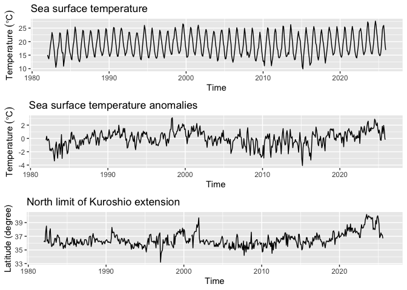
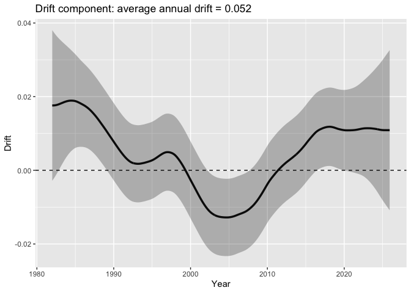
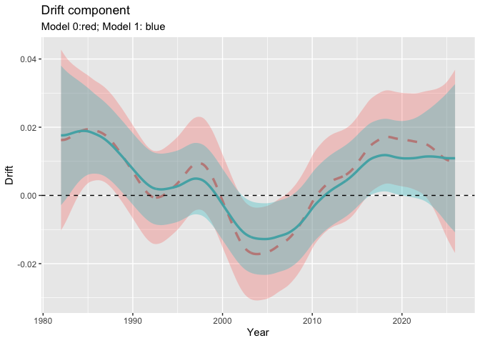

# 解析環境の設定

    ## 各種ライブラリーの読み込み
    library(KFAS)
    library(tidyverse)
    library(lubridate)
    library(forecast)
    # あとで使うautoplot関数はtidyverseとforecast両方に存在して競合するので、必ず上の順番でライブラリを読み込んでください！
    library(gridExtra)

    # initialize
    rm(list=ls(all=TRUE))

# 海面水温時系列データの読み込み

    SST_monthly_df2ts <- function(SST_monthly_df){
      start_year_month <- min(SST_monthly_df$Time)

      # ts型に変換
      SST_ts <- SST_monthly_df %>% 
        dplyr::select(-Time) %>%             # 日付列と秋冬フラグを削除
        ts(start = c(year(start_year_month), month(start_year_month)), 
          frequency = 12) # ts型に変換(1998年1月開始。12か月1周期)
    }

    #沿岸域の海面水温情報
    #https://www.data.jma.go.jp/kaiyou/data/db/kaikyo/series/engan/engan.html
    #上記のサイトから、対象の海域番号を調べる
    #（例えば、岩手県南部沿岸の海域番号は113)

    # 水温データのソースの指定: local, url, or, original
    source <- "local" # local (default), url, or original
    # local:　local環境にある提供データ: ulr: 気象庁公開のデータ; original: 自身が用意されたオリジナルデータ

    if(source=="url"){ #ウェブサイトから海面水温データを読み込む場合
      sea_are_id <- 138　#138: 茨城県南部沿岸; #113 岩手県南部沿岸海域の例; 122: 釧路地方沿岸; 709: 与那国島; 315:佐渡島; 306: 相模湾; 311: 遠州灘; 321: 福井県沿岸
      url <- paste0("https://www.data.jma.go.jp/kaiyou/data/db/kaikyo/series/engan/txt/area",
                    sea_are_id,
                    ".txt")

      SST_info <- read_csv(url) %>% 
        slice(-n()) %>%
        rename(Temp="Temp.") %>% 
        mutate(Temp = as.numeric(Temp)) %>%
        mutate(date=as.Date(paste0(yyyy,"-",mm,"-",dd))) %>% 
        select(c(date,Temp,flag)) %>% 
        filter(date <= as.Date("2025-12-31"))
      
      #　SSTを月別平均に集約
      SST_monthly_avg <- SST_info %>% 
        mutate(Time = floor_date(date, unit = "month")) %>% 
        group_by(Time) %>% 
        summarise(Temp = mean(Temp, na.rm = TRUE))

      SST_ts <- SST_monthly_df2ts(SST_monthly_avg)
      SST_ts <- window(SST_ts, end = c(2025,12))
      
      
    }else if(source=="local"){ #ローカルにある海面水温データファイルを読み込む場合
      SST_info <- read_csv("SST_area138.csv") %>%  #岩手県南部沿岸海域の海面水温データ（デフォルト）
        rename(Temp="Temp.") %>% 
        mutate(date=as.Date(paste0(yyyy,"-",mm,"-",dd))) %>% 
        select(c(date,Temp,flag))
      
      #　SSTを月別平均に集約
      SST_monthly_avg <- SST_info %>% 
        mutate(Time = floor_date(date, unit = "month")) %>% 
        group_by(Time) %>% 
        summarise(Temp = mean(Temp, na.rm = TRUE))
      
      SST_ts <- SST_monthly_df2ts(SST_monthly_avg)
      SST_ts <- window(SST_ts, end = c(2025,12))
      
    }else if(source=="original"){ #ローカルに置いたオリジナルの海面水温データファイルを読み込む場合
      year_month_temp <- read_csv("SST_original.csv")
      
      SST_ts <- ts(year_month_temp$Temp,
                   start = c(year_month_temp$Year[1], year_month_temp$Month[1]),
                   frequency = 12) # ts型に変換(12か月1周期)
      names(SST_ts) <- "Temp"

    }else{
      
    }

    head(SST_ts)

    ##           Jan      Feb      Mar      Apr      May      Jun
    ## 1982 15.04419 14.22500 13.63903 15.31933 17.52258 19.52300

# tsオブジェクトの内容の確認

    frequency(SST_ts)   # 周波数（12）

    ## [1] 12

    start(SST_ts)       # 開始（1982, 1）

    ## [1] 1982    1

    end(SST_ts)         # 終了（2025, 10）

    ## [1] 2025   12

    cycle(SST_ts)       # 各観測の月番号（1～12）

    ##      Jan Feb Mar Apr May Jun Jul Aug Sep Oct Nov Dec
    ## 1982   1   2   3   4   5   6   7   8   9  10  11  12
    ## 1983   1   2   3   4   5   6   7   8   9  10  11  12
    ## 1984   1   2   3   4   5   6   7   8   9  10  11  12
    ## 1985   1   2   3   4   5   6   7   8   9  10  11  12
    ## 1986   1   2   3   4   5   6   7   8   9  10  11  12
    ## 1987   1   2   3   4   5   6   7   8   9  10  11  12
    ## 1988   1   2   3   4   5   6   7   8   9  10  11  12
    ## 1989   1   2   3   4   5   6   7   8   9  10  11  12
    ## 1990   1   2   3   4   5   6   7   8   9  10  11  12
    ## 1991   1   2   3   4   5   6   7   8   9  10  11  12
    ## 1992   1   2   3   4   5   6   7   8   9  10  11  12
    ## 1993   1   2   3   4   5   6   7   8   9  10  11  12
    ## 1994   1   2   3   4   5   6   7   8   9  10  11  12
    ## 1995   1   2   3   4   5   6   7   8   9  10  11  12
    ## 1996   1   2   3   4   5   6   7   8   9  10  11  12
    ## 1997   1   2   3   4   5   6   7   8   9  10  11  12
    ## 1998   1   2   3   4   5   6   7   8   9  10  11  12
    ## 1999   1   2   3   4   5   6   7   8   9  10  11  12
    ## 2000   1   2   3   4   5   6   7   8   9  10  11  12
    ## 2001   1   2   3   4   5   6   7   8   9  10  11  12
    ## 2002   1   2   3   4   5   6   7   8   9  10  11  12
    ## 2003   1   2   3   4   5   6   7   8   9  10  11  12
    ## 2004   1   2   3   4   5   6   7   8   9  10  11  12
    ## 2005   1   2   3   4   5   6   7   8   9  10  11  12
    ## 2006   1   2   3   4   5   6   7   8   9  10  11  12
    ## 2007   1   2   3   4   5   6   7   8   9  10  11  12
    ## 2008   1   2   3   4   5   6   7   8   9  10  11  12
    ## 2009   1   2   3   4   5   6   7   8   9  10  11  12
    ## 2010   1   2   3   4   5   6   7   8   9  10  11  12
    ## 2011   1   2   3   4   5   6   7   8   9  10  11  12
    ## 2012   1   2   3   4   5   6   7   8   9  10  11  12
    ## 2013   1   2   3   4   5   6   7   8   9  10  11  12
    ## 2014   1   2   3   4   5   6   7   8   9  10  11  12
    ## 2015   1   2   3   4   5   6   7   8   9  10  11  12
    ## 2016   1   2   3   4   5   6   7   8   9  10  11  12
    ## 2017   1   2   3   4   5   6   7   8   9  10  11  12
    ## 2018   1   2   3   4   5   6   7   8   9  10  11  12
    ## 2019   1   2   3   4   5   6   7   8   9  10  11  12
    ## 2020   1   2   3   4   5   6   7   8   9  10  11  12
    ## 2021   1   2   3   4   5   6   7   8   9  10  11  12
    ## 2022   1   2   3   4   5   6   7   8   9  10  11  12
    ## 2023   1   2   3   4   5   6   7   8   9  10  11  12
    ## 2024   1   2   3   4   5   6   7   8   9  10  11  12
    ## 2025   1   2   3   4   5   6   7   8   9  10  11  12

    time(SST_ts)        # 小数年（1982.000, 1982.083...）

    ##           Jan      Feb      Mar      Apr      May      Jun      Jul      Aug
    ## 1982 1982.000 1982.083 1982.167 1982.250 1982.333 1982.417 1982.500 1982.583
    ## 1983 1983.000 1983.083 1983.167 1983.250 1983.333 1983.417 1983.500 1983.583
    ## 1984 1984.000 1984.083 1984.167 1984.250 1984.333 1984.417 1984.500 1984.583
    ## 1985 1985.000 1985.083 1985.167 1985.250 1985.333 1985.417 1985.500 1985.583
    ## 1986 1986.000 1986.083 1986.167 1986.250 1986.333 1986.417 1986.500 1986.583
    ## 1987 1987.000 1987.083 1987.167 1987.250 1987.333 1987.417 1987.500 1987.583
    ## 1988 1988.000 1988.083 1988.167 1988.250 1988.333 1988.417 1988.500 1988.583
    ## 1989 1989.000 1989.083 1989.167 1989.250 1989.333 1989.417 1989.500 1989.583
    ## 1990 1990.000 1990.083 1990.167 1990.250 1990.333 1990.417 1990.500 1990.583
    ## 1991 1991.000 1991.083 1991.167 1991.250 1991.333 1991.417 1991.500 1991.583
    ## 1992 1992.000 1992.083 1992.167 1992.250 1992.333 1992.417 1992.500 1992.583
    ## 1993 1993.000 1993.083 1993.167 1993.250 1993.333 1993.417 1993.500 1993.583
    ## 1994 1994.000 1994.083 1994.167 1994.250 1994.333 1994.417 1994.500 1994.583
    ## 1995 1995.000 1995.083 1995.167 1995.250 1995.333 1995.417 1995.500 1995.583
    ## 1996 1996.000 1996.083 1996.167 1996.250 1996.333 1996.417 1996.500 1996.583
    ## 1997 1997.000 1997.083 1997.167 1997.250 1997.333 1997.417 1997.500 1997.583
    ## 1998 1998.000 1998.083 1998.167 1998.250 1998.333 1998.417 1998.500 1998.583
    ## 1999 1999.000 1999.083 1999.167 1999.250 1999.333 1999.417 1999.500 1999.583
    ## 2000 2000.000 2000.083 2000.167 2000.250 2000.333 2000.417 2000.500 2000.583
    ## 2001 2001.000 2001.083 2001.167 2001.250 2001.333 2001.417 2001.500 2001.583
    ## 2002 2002.000 2002.083 2002.167 2002.250 2002.333 2002.417 2002.500 2002.583
    ## 2003 2003.000 2003.083 2003.167 2003.250 2003.333 2003.417 2003.500 2003.583
    ## 2004 2004.000 2004.083 2004.167 2004.250 2004.333 2004.417 2004.500 2004.583
    ## 2005 2005.000 2005.083 2005.167 2005.250 2005.333 2005.417 2005.500 2005.583
    ## 2006 2006.000 2006.083 2006.167 2006.250 2006.333 2006.417 2006.500 2006.583
    ## 2007 2007.000 2007.083 2007.167 2007.250 2007.333 2007.417 2007.500 2007.583
    ## 2008 2008.000 2008.083 2008.167 2008.250 2008.333 2008.417 2008.500 2008.583
    ## 2009 2009.000 2009.083 2009.167 2009.250 2009.333 2009.417 2009.500 2009.583
    ## 2010 2010.000 2010.083 2010.167 2010.250 2010.333 2010.417 2010.500 2010.583
    ## 2011 2011.000 2011.083 2011.167 2011.250 2011.333 2011.417 2011.500 2011.583
    ## 2012 2012.000 2012.083 2012.167 2012.250 2012.333 2012.417 2012.500 2012.583
    ## 2013 2013.000 2013.083 2013.167 2013.250 2013.333 2013.417 2013.500 2013.583
    ## 2014 2014.000 2014.083 2014.167 2014.250 2014.333 2014.417 2014.500 2014.583
    ## 2015 2015.000 2015.083 2015.167 2015.250 2015.333 2015.417 2015.500 2015.583
    ## 2016 2016.000 2016.083 2016.167 2016.250 2016.333 2016.417 2016.500 2016.583
    ## 2017 2017.000 2017.083 2017.167 2017.250 2017.333 2017.417 2017.500 2017.583
    ## 2018 2018.000 2018.083 2018.167 2018.250 2018.333 2018.417 2018.500 2018.583
    ## 2019 2019.000 2019.083 2019.167 2019.250 2019.333 2019.417 2019.500 2019.583
    ## 2020 2020.000 2020.083 2020.167 2020.250 2020.333 2020.417 2020.500 2020.583
    ## 2021 2021.000 2021.083 2021.167 2021.250 2021.333 2021.417 2021.500 2021.583
    ## 2022 2022.000 2022.083 2022.167 2022.250 2022.333 2022.417 2022.500 2022.583
    ## 2023 2023.000 2023.083 2023.167 2023.250 2023.333 2023.417 2023.500 2023.583
    ## 2024 2024.000 2024.083 2024.167 2024.250 2024.333 2024.417 2024.500 2024.583
    ## 2025 2025.000 2025.083 2025.167 2025.250 2025.333 2025.417 2025.500 2025.583
    ##           Sep      Oct      Nov      Dec
    ## 1982 1982.667 1982.750 1982.833 1982.917
    ## 1983 1983.667 1983.750 1983.833 1983.917
    ## 1984 1984.667 1984.750 1984.833 1984.917
    ## 1985 1985.667 1985.750 1985.833 1985.917
    ## 1986 1986.667 1986.750 1986.833 1986.917
    ## 1987 1987.667 1987.750 1987.833 1987.917
    ## 1988 1988.667 1988.750 1988.833 1988.917
    ## 1989 1989.667 1989.750 1989.833 1989.917
    ## 1990 1990.667 1990.750 1990.833 1990.917
    ## 1991 1991.667 1991.750 1991.833 1991.917
    ## 1992 1992.667 1992.750 1992.833 1992.917
    ## 1993 1993.667 1993.750 1993.833 1993.917
    ## 1994 1994.667 1994.750 1994.833 1994.917
    ## 1995 1995.667 1995.750 1995.833 1995.917
    ## 1996 1996.667 1996.750 1996.833 1996.917
    ## 1997 1997.667 1997.750 1997.833 1997.917
    ## 1998 1998.667 1998.750 1998.833 1998.917
    ## 1999 1999.667 1999.750 1999.833 1999.917
    ## 2000 2000.667 2000.750 2000.833 2000.917
    ## 2001 2001.667 2001.750 2001.833 2001.917
    ## 2002 2002.667 2002.750 2002.833 2002.917
    ## 2003 2003.667 2003.750 2003.833 2003.917
    ## 2004 2004.667 2004.750 2004.833 2004.917
    ## 2005 2005.667 2005.750 2005.833 2005.917
    ## 2006 2006.667 2006.750 2006.833 2006.917
    ## 2007 2007.667 2007.750 2007.833 2007.917
    ## 2008 2008.667 2008.750 2008.833 2008.917
    ## 2009 2009.667 2009.750 2009.833 2009.917
    ## 2010 2010.667 2010.750 2010.833 2010.917
    ## 2011 2011.667 2011.750 2011.833 2011.917
    ## 2012 2012.667 2012.750 2012.833 2012.917
    ## 2013 2013.667 2013.750 2013.833 2013.917
    ## 2014 2014.667 2014.750 2014.833 2014.917
    ## 2015 2015.667 2015.750 2015.833 2015.917
    ## 2016 2016.667 2016.750 2016.833 2016.917
    ## 2017 2017.667 2017.750 2017.833 2017.917
    ## 2018 2018.667 2018.750 2018.833 2018.917
    ## 2019 2019.667 2019.750 2019.833 2019.917
    ## 2020 2020.667 2020.750 2020.833 2020.917
    ## 2021 2021.667 2021.750 2021.833 2021.917
    ## 2022 2022.667 2022.750 2022.833 2022.917
    ## 2023 2023.667 2023.750 2023.833 2023.917
    ## 2024 2024.667 2024.750 2024.833 2024.917
    ## 2025 2025.667 2025.750 2025.833 2025.917

    window(SST_ts, start = c(2000, 1), end = c(2005, 12))  # 期間抽出

    ##           Jan      Feb      Mar      Apr      May      Jun      Jul      Aug
    ## 2000 16.73032 14.20414 14.27419 14.73033 17.51581 21.23900 22.84645 25.28774
    ## 2001 16.30677 15.79500 15.03742 16.67533 18.87774 21.65100 24.97935 26.09419
    ## 2002 15.82581 14.83107 14.57129 16.47700 18.66742 21.14767 23.26129 24.50710
    ## 2003 15.67000 13.87107 13.78129 15.68200 17.89516 20.41500 22.17516 23.81839
    ## 2004 14.98161 12.81862 13.33355 15.47233 17.50194 20.26200 22.89290 24.19710
    ## 2005 15.21000 13.60321 13.66065 15.22700 17.59290 19.61100 21.96516 24.97097
    ##           Sep      Oct      Nov      Dec
    ## 2000 24.74200 22.29484 21.02267 18.49323
    ## 2001 24.32400 22.53935 20.68533 18.92161
    ## 2002 23.75067 21.10065 17.87967 16.86871
    ## 2003 23.37100 21.51806 18.76600 17.33968
    ## 2004 24.22167 22.40935 19.46567 18.25839
    ## 2005 23.67767 20.77032 19.09567 14.77516

# SSTの時系列折れ線グラフ

    SST_ts_source_plot <- autoplot(SST_ts) +
      labs(y = expression(Temperature~(degree*C)), x = "Time") +
      ggtitle("Sea surface temperature")

    plot(SST_ts_source_plot)

# SST偏差系列の作成

    stopifnot(frequency(SST_ts) == 12)  # 月次であることの確認

    temp <- as.numeric(SST_ts)

    # 月番号（1〜12）を取得
    #mnum <- factor(cycle(SST_ts),levels = 1:12)
    mnum <- cycle(SST_ts)

    # 念のため 1:12 の factor に固定（欠月があっても 12要素の平均が返る）
    mfac <- factor(mnum, levels = 1:12)

    # 3) 月別の長期平均（気候値）を作る
    monthly_mean <- tapply(temp, mfac, function(v) mean(v, na.rm = TRUE))

    # 各観測に対応する月平均を展開
    clim <- monthly_mean[as.integer(mfac)]

    # 4) 海水温偏差を計算
    anom <- temp - clim

    SST_dev_ts <- cbind(Temp=SST_ts, Temp_dev=anom)

    head(SST_dev_ts)

    ##              Temp    Temp_dev
    ## Jan 1982 15.04419 -0.24143695
    ## Feb 1982 14.22500  0.32942650
    ## Mar 1982 13.63903 -0.34256598
    ## Apr 1982 15.31933 -0.20575758
    ## May 1982 17.52258 -0.08825513
    ## Jun 1982 19.52300 -0.50583333

# 月平均SSTのプロット

    monthly_mean_fac_tidy = tibble(Month=factor(1:12,
                                            levels=(1:12)),
           SST=as.numeric(monthly_mean)
           )

    monthly_mean_tidy = tibble(Month=(1:12),
           SST=as.numeric(monthly_mean)
           )

    head(monthly_mean_tidy)

    ## # A tibble: 6 × 2
    ##   Month   SST
    ##   <int> <dbl>
    ## 1     1  15.3
    ## 2     2  13.9
    ## 3     3  14.0
    ## 4     4  15.5
    ## 5     5  17.6
    ## 6     6  20.0

    plot_monthly_mean_SST <- ggplot(data=monthly_mean_fac_tidy,
                                     aes(x=Month,y=SST)
                                     ) +
      geom_point(size = 1) + 
      geom_line(data=monthly_mean_tidy,
                aes(x=Month,y=SST),linetype= "dashed") + 
      #geom_smooth(method="loess", se =FALSE)
      scale_x_discrete(
        labels = function(x) sprintf("%02d", as.integer(x))
      )
      
    plot_monthly_mean_SST

# SST偏差系列のプロット：autoplot

    autoplot(SST_dev_ts)

# SST偏差系列のプロット: ggplot

    SST_ts_plot <- autoplot(SST_dev_ts[,"Temp"]) +
      labs(y = expression(Temperature~(degree*C)), x = "Time") +
      ggtitle("Sea surface temperature")

    SST_dev_ts_plot <- autoplot(SST_dev_ts[,"Temp_dev"]) +
      labs(y = expression(Temperature~(degree*C)), x = "Time") +
      ggtitle("Sea surface temperature anomalies")

    # 並べる
    SST_ts_source_plot <- gridExtra::grid.arrange(SST_ts_plot,
                                                  SST_dev_ts_plot,
                                                  ncol = 1)

    plot(SST_ts_source_plot)

# 線形ガウス状態空間モデルの定義（外生変数なしモデル：Model 0）

    make_ssm_M0 <- function(ts_data) {
      # モデルの構造を決める
      build_ssm <- SSModel(
        H = NA,
        Temp ~
          SSMtrend(degree = 2,                  # 平滑化トレンドモデル
                   Q = c(list(0), list(NA))) +
          SSMseasonal(
            sea.type = "dummy", # ダミー変数を利用した季節成分
            period = 12,        # 周期は12とする
            Q = NA
          ) +
          SSMarima(
            ar = c(0, 0),       # 2次のAR成分
            d = 0,
            Q = 0
          ),
        data = ts_data
      )
      
      # optimに渡す前にパラメータをexpしたりartransformしたり、変換する
      # ほぼbuild_ssmと同じだが、パラメータだけ変更されている
      update_func <- function(pars, model) {
        model <- SSModel(
          H = exp(pars[6]),
          Temp ~
            SSMtrend(degree = 2,
                     Q = c(list(0), list(exp(pars[1])))) +
            SSMseasonal(
              sea.type = "dummy",
              period = 12,
              Q = exp(pars[2])
            ) +
            SSMarima(
              ar = artransform(pars[3:4]),
              d = 0,
              Q = exp(pars[5])
            ),
          data = ts_data
        )
      }
      
      
      # 最適化その1。まずはNelder-Mead法を用いて暫定的なパラメータを推定
      fit_ssm_bef <- fitSSM(
        build_ssm,
        #inits = c(-17,-30, 0.5, 0, -1, -3), # パラメータの初期値(任意)
        inits = c(-13,-7, 0.9, -0.1, -0.3, -5), # パラメータの初期値(任意)
        update_func,
        method = "Nelder-Mead",
        control = list(maxit = 5000, reltol = 1e-16)
      )
      
      # 最適化その2。先ほどの結果を初期値に使ってもう一度最適化する
      fit_ssm <- fitSSM(
        build_ssm,
        inits = fit_ssm_bef$optim.out$par,
        update_func,
        method = "BFGS",
        control = list(maxit = 5000, reltol = 1e-16)
      )
      
      # フィルタリングとスムージング
      result_ssm <- KFS(
        fit_ssm$model,
        filtering = c("state", "mean"),
        smoothing = c("state", "mean", "disturbance")
      )
      
      # 結果の出力
      return(list(fit_ssm, result_ssm))
      
    }

# M0モデル関数の適用

    list_M0 <- make_ssm_M0(SST_dev_ts)
    fit_M0    <- list_M0[[1]]
    result_M0 <- list_M0[[2]]

    # 係数の95%信頼区間
    res_M0 <- confint(result_M0, level = 0.95)

# M0モデルの推定結果の確認

    par_M0 <- fit_M0$optim.out$par #モデルの推定パラメーター
    par_comp_M0 <- c(Q_trend  = exp(par_M0[1]), # 年トレンドの大きさ
                      Q_season = exp(par_M0[2]), # 季節トレンドの大きさ
                      AR1      = artransform(par_M0[3:4])[1], # 1次のARの大きさ
                      AR2      = artransform(par_M0[3:4])[2], # 2次のARの大きさ
                      Q_ar     = exp(par_M0[5]), # 短期変動の揺らぎ
                      H        = exp(par_M0[6])) # 観察誤差の大きさ

    # 平滑化推定量
    alpha_hat_M0 <- result_M0$alphahat
    head(alpha_hat_M0)

    ##             level      slope sea_dummy1 sea_dummy2 sea_dummy3 sea_dummy4
    ## Jan 1982 17.45868 0.01625144  -3.470558  -1.801915  0.3388803  2.7790543
    ## Feb 1982 17.47493 0.01625139  -4.958038  -3.470558 -1.8019153  0.3388803
    ## Mar 1982 17.49118 0.01626272  -4.824835  -4.958038 -3.4705575 -1.8019153
    ## Apr 1982 17.50744 0.01628112  -3.279939  -4.824835 -4.9580381 -3.4705575
    ## May 1982 17.52372 0.01630892  -1.203128  -3.279939 -4.8248350 -4.9580381
    ## Jun 1982 17.54003 0.01635052   1.263210  -1.203128 -3.2799392 -4.8248350
    ##          sea_dummy5 sea_dummy6 sea_dummy7 sea_dummy8 sea_dummy9 sea_dummy10
    ## Jan 1982  5.2114470  6.1168103  3.8290113  1.2632100  -1.203128   -3.279939
    ## Feb 1982  2.7790543  5.2114470  6.1168103  3.8290113   1.263210   -1.203128
    ## Mar 1982  0.3388803  2.7790543  5.2114470  6.1168103   3.829011    1.263210
    ## Apr 1982 -1.8019153  0.3388803  2.7790543  5.2114470   6.116810    3.829011
    ## May 1982 -3.4705575 -1.8019153  0.3388803  2.7790543   5.211447    6.116810
    ## Jun 1982 -4.9580381 -3.4705575 -1.8019153  0.3388803   2.779054    5.211447
    ##          sea_dummy11    arima1      arima2
    ## Jan 1982   -4.824835 1.0560741 -0.06457844
    ## Feb 1982   -3.279939 1.7081097 -0.13157674
    ## Mar 1982   -1.203128 0.9726875 -0.21281413
    ## Apr 1982    1.263210 1.0918300 -0.12118755
    ## May 1982    3.829011 1.2019851 -0.13603158
    ## Jun 1982    6.116810 0.7197574 -0.14975585

    level_M0 <- alpha_hat_M0[,"level"]
    drift_M0 <- alpha_hat_M0[,"slope"]

    level_M0_ts <- ts(level_M0, start = start(SST_ts), frequency = 12)
    drift_M0_ts <- ts(drift_M0, start = start(SST_ts), frequency = 12)

    # 馬場ら（2024)との比較のため, 2023年2月のドリフト成分の抽出
    window(drift_M0_ts, start=c(2023, 2), end=c(2023, 2))

    ##             Feb
    ## 2023 0.01442835

    # 年あたりの平均的な昇温率
    mean_drift_year_M0 <- mean(drift_M0_ts) * 12
    print(mean_drift_year_M0)

    ## [1] 0.06181994

    # 成分別にプロット
    level_M0_plot <- autoplot(result_M0$alphahat[,"level"]) +
      labs(y = "", x = "Time") +
      ggtitle("Level component")

    drift_M0_plot <- autoplot(result_M0$alphahat[,"slope"]) +
      labs(y = "", x = "Time") +
      ggtitle("Drift component")

    season_M0_plot <- autoplot(result_M0$alphahat[,"sea_dummy1"]) +
      labs(y = "", x = "Time") +
      ggtitle("Seasonal component")

    arima1_M0_plot <- autoplot(result_M0$alphahat[,"arima1"]) +
      labs(y = "", x = "Time") +
      ggtitle("Auto-regression component")

    M0_out_plot <- grid.arrange(level_M0_plot,
                                drift_M0_plot,
                                season_M0_plot,
                                arima1_M0_plot,
                                ncol = 1)

    plot(M0_out_plot)

# M0モデルの残差のチェック

    # 標準化残差
    std_obs_resid_M0 <- rstandard(result_M0, type = "recursive")

    # forecastパッケージのcheckredisual関数で残差のチェック
    # Ljung–Box検定: P > 0.05で残差に有意な自己相関なしと判断
    checkresiduals(std_obs_resid_M0)

    ## 
    ##  Ljung-Box test
    ## 
    ## data:  Residuals
    ## Q* = 28.235, df = 24, p-value = 0.2502
    ## 
    ## Model df: 0.   Total lags used: 24

    # 図示された残差（上：残差系列；左下：残差コレログラム；右下：残差のヒストグラム）をみて異常に突出した残差がないかなどを確認

    #正規性の確認
    # P > 0.05で正規分布と有意に異なっていないと判断
    shapiro.test(std_obs_resid_M0)

    ## 
    ##  Shapiro-Wilk normality test
    ## 
    ## data:  std_obs_resid_M0
    ## W = 0.99552, p-value = 0.1467

# 水準変動とその95%信頼区間の図示

    level_M0_tidy <- cbind(
      data.frame(time=time(SST_ts),
                 SST=as.numeric(SST_ts),
                 level_M0=level_M0),
      as.data.frame(res_M0$level)
      ) %>%
      as_tibble() %>%
      rename(lwr_M0=lwr,upr_M0=upr)

    level_M0_ggplot <- ggplot(data=level_M0_tidy,
                             aes(x=time,y=level_M0)) +
      labs(title="Level component",x="Year", y="SST") +
      geom_line(aes(y=level_M0), size = 1.2) +
      geom_ribbon(aes(ymin = lwr_M0, ymax = upr_M0), alpha = 0.3)

    ggsave("level_M0_plot.png",
           width=6, height=4,
           plot = level_M0_ggplot)

    level_M0_ggplot

# ドリフト成分とその95%信頼区間の図示

    drift_M0_tidy <- cbind(
      data.frame(time=time(SST_ts),
                 Temp=as.numeric(SST_ts),
                 drift_M0=drift_M0),
      as.data.frame(res_M0$slope)
      ) %>%
      as_tibble() %>%
      rename(lwr_M0=lwr,upr_M0=upr)

    annual_drift_M0_lab <- paste0("average annual drift = ",round(mean_drift_year_M0,3))

    drift_M0_ggplot <- ggplot(data=drift_M0_tidy,
                             aes(x=time,y=drift_M0)) +
      labs(title=paste0("Drift component: ",annual_drift_M0_lab),
           x="Year", y="Drift") +
      geom_line(aes(y=drift_M0), size = 1.2) +
      geom_ribbon(aes(ymin = lwr_M0, ymax = upr_M0), alpha = 0.3) +
      geom_hline(yintercept=0, linetype="dashed") 

    ggsave("drift_M0_plot.png",
           width=6, height=4,
           plot = drift_M0_ggplot)

    drift_M0_ggplot

# 予測 ———————————————————————-

    # n.ahead=6: ６時点先までを予測
    forecast_pred_M0 <- predict(result_M0$model,
                             interval="prediction",
                             level = 0.95,
                             n.ahead = 6)

    print(forecast_pred_M0)

    ##               fit      lwr      upr
    ## Jan 2026 15.82342 14.35276 17.29409
    ## Feb 2026 14.90946 13.08821 16.73070
    ## Mar 2026 15.23200 13.30180 17.16220
    ## Apr 2026 16.84039 14.87208 18.80869
    ## May 2026 18.99222 17.00610 20.97833
    ## Jun 2026 21.37939 19.38160 23.37718

# =============================================================================================

# 欠損データの解析 ———————————————————————-

    # 欠損データセットの作成
    # 時系列データの半期から８年の観測値を欠損とする
    half_point <- trunc(length(time(SST_ts))/2)
    NA_point <- c(half_point:(half_point+96))
    SST_NA_ts <- SST_ts
    SST_NA_ts[NA_point] <- NA 

    SST_NA_ts_source_plot <- autoplot(SST_NA_ts) +
      labs(y = expression(Temperature~(degree*C)), x = "Time") +
      ggtitle("Sea surface temperature")

    plot(SST_NA_ts_source_plot)

# M0モデルの適用

    list_M0_NA <- make_ssm_M0(SST_NA_ts)
    fit_M0_NA <- list_M0_NA[[1]]
    result_M0_NA <- list_M0_NA[[2]]

    # 成分別にプロット
    level_M0_NA_plot <- autoplot(result_M0_NA$alphahat[,"level"]) +
      labs(y = "", x = "Time") +
      ggtitle("Level component")

    drift_M0_NA_plot <- autoplot(result_M0_NA$alphahat[,"slope"]) +
      labs(y = "", x = "Time") +
      ggtitle("Drift component")

    season_M0_NA_plot <- autoplot(result_M0_NA$alphahat[,"sea_dummy1"]) +
      labs(y = "", x = "Time") +
      ggtitle("Seasonal component")

    arima1_M0_NA_plot <- autoplot(result_M0_NA$alphahat[,"arima1"]) +
      labs(y = "", x = "Time") +
      ggtitle("Auto-regression component")

    M0_NA_out_plot <- grid.arrange(level_M0_NA_plot,
                                   drift_M0_NA_plot,
                                   season_M0_NA_plot,
                                   arima1_M0_NA_plot,
                                   ncol = 1)

    plot(M0_NA_out_plot)

# =============================================================================================

# 外生変数組み込みモデルの解析 —————————————————————-

# 黒潮続流北限緯度データの読み込み

# <https://ocean.fra.go.jp/temp/O-K.html>

# 本データの2次利用配布は不可とさせていただきます。

    #黒潮続流北限緯度データの読み込み
    Kuroshio_df <- read_table("gknmay9.txt",
                              col_names=FALSE) %>%
      rename(Year="X1",
             Month="X2",
             Kuroshio="X4") %>%
      mutate(Time=as.Date(paste0(Year,"-",Month,"-01"))) %>%
      dplyr::select(Time, Kuroshio) %>%
      mutate(Kuroshio=na_if(Kuroshio, 999)) #黒潮続流データの欠損値999をNAに置換

    Kuroshio_start_year <- min(Kuroshio_df$Time) %>% year()
    Kuroshio_start_month <- min(Kuroshio_df$Time) %>% month()

    Kuroshio_ts <- ts(Kuroshio_df$Kuroshio,
                      start=c(Kuroshio_start_year,
                              Kuroshio_start_month),
                      frequency = 12)

    names(Kuroshio_ts) <- "Kuroshio"
     
    start_Kuroshio_ts <- start(Kuroshio_ts)
    end_Kuroshio_ts <- end(Kuroshio_ts)

    start_SST_ts <- start(SST_dev_ts)
    end_SST_ts <- end(SST_dev_ts)

    # SSTと黒潮続流北限緯度の時系列データを重複期間で統合
    SST_Kuroshio_ts  <- ts.intersect(Temp = SST_dev_ts[,"Temp"],
                                     Temp_dev = SST_dev_ts[,"Temp_dev"],
                                     Kuroshio=Kuroshio_ts,
                                     Kuroshio_scaled=scale(Kuroshio_ts) #標準化(平均０、標準偏差1)
                                     )

    head(SST_Kuroshio_ts)

    ##              Temp    Temp_dev Kuroshio Kuroshio_scaled
    ## Jan 1982 15.04419 -0.24143695     36.2      -0.4145082
    ## Feb 1982 14.22500  0.32942650     36.3      -0.3104027
    ## Mar 1982 13.63903 -0.34256598     36.2      -0.4145082
    ## Apr 1982 15.31933 -0.20575758     37.7       1.1470739
    ## May 1982 17.52258 -0.08825513     38.5       1.9799177
    ## Jun 1982 19.52300 -0.50583333     36.3      -0.3104027

# SSTの時系列折れ線グラフ

    # 時系列折れ線グラフ
    SST_ts_plot2 <- autoplot(SST_Kuroshio_ts[,"Temp"]) +
      labs(y = expression(Temperature~(degree*C)), x = "Time") +
      ggtitle("Sea surface temperature")

    SST_dev_ts_plot2 <- autoplot(SST_Kuroshio_ts[,"Temp_dev"]) +
      labs(y = expression(Temperature~(degree*C)), x = "Time") +
      ggtitle("Sea surface temperature anomalies")

    Kuroshio_ts_plot <- autoplot(SST_Kuroshio_ts[,"Kuroshio"]) +
      labs(y = "Latitude (degree)", x = "Time") +
      ggtitle("North limit of Kuroshio extension")

    # 並べてプロット
    SST_Kuroshio_ts_plot <- gridExtra::grid.arrange(SST_ts_plot2, 
                            SST_dev_ts_plot2,
                            Kuroshio_ts_plot,
                            ncol = 1)

    plot(SST_Kuroshio_ts_plot)

# 線形ガウス状態空間モデル(外生変数あり: M1）

    make_ssm_M1 <- function(ts_data) {
      # モデルの構造を決める
      build_ssm <- SSModel(
        H = NA,
        Temp ~
          SSMtrend(degree = 2,                  # 平滑化トレンドモデル
                   Q = c(list(0), list(NA))) +
          SSMseasonal(
            sea.type = "dummy", # ダミー変数を利用した季節成分
            period = 12,        # 周期は12とする
            Q = NA
          ) +
          SSMarima(
            ar = c(0, 0),       # 2次のAR成分
            d = 0,
            Q = 0
          ) + 
          SSMregression(
            ~ Kuroshio_scaled, Q = 0
            ), # 外生変数
        data = ts_data
      )
      
      # optimに渡す前にパラメータをexpしたりartransformしたり、変換する
      # ほぼbuild_ssmと同じだが、パラメータだけ変更されている
      update_func <- function(pars, model) {
        model <- SSModel(
          H = exp(pars[6]),
          Temp ~
            SSMtrend(degree = 2,
                     Q = c(list(0), list(exp(pars[1])))) +
            SSMseasonal(
              sea.type = "dummy",
              period = 12,
              Q = exp(pars[2])
            ) +
            SSMarima(
              ar = artransform(pars[3:4]),
              d = 0,
              Q = exp(pars[5])
            ) + 
            SSMregression(
              ~ Kuroshio_scaled, Q = 0
            ), # 外生変数
          data = ts_data
        )
      }
      
      
      # 最適化その1。まずはNelder-Mead法を用いて暫定的なパラメータを推定
      fit_ssm_bef <- fitSSM(
        build_ssm,
        inits = c(-17,-30, 0.5, 0, -1,-5), # パラメータの初期値(任意)
        update_func,
        method = "Nelder-Mead",
        control = list(maxit = 5000, reltol = 1e-16)
      )
      
      # 最適化その2。先ほどの結果を初期値に使ってもう一度最適化する
      fit_ssm <- fitSSM(
        build_ssm,
        inits = fit_ssm_bef$optim.out$par,
        update_func,
        method = "BFGS",
        control = list(maxit = 5000, reltol = 1e-16)
      )
      
      # フィルタリングとスムージング
      result_ssm <- KFS(
        fit_ssm$model,
        filtering = c("state", "mean"),
        smoothing = c("state", "mean", "disturbance")
      )
      
      # 結果の出力
      return(list(fit_ssm, result_ssm))
      
    }

# モデル関数の適用

    list_M1 <- make_ssm_M1(SST_Kuroshio_ts)
    fit_M1    <- list_M1[[1]]
    result_M1 <- list_M1[[2]]

    # 係数の95%信頼区間
    res_M1 <- confint(result_M1, level = 0.95)

# 推定結果の確認

    par_M1 <- fit_M1$optim.out$par #モデルの推定パラメーター
    par_comp_M1 <- c(Q_trend  = exp(par_M1[1]), # 年トレンドの大きさ
                      Q_season = exp(par_M1[2]), # 季節トレンドの大きさ
                      AR1      = artransform(par_M1[3:4])[1], # 1次のARの大きさ
                      AR2      = artransform(par_M1[3:4])[2], # 2次のARの大きさ
                      Q_ar     = exp(par_M1[5]), # 短期変動の揺らぎ
                      H        = exp(par_M1[6])) # 観察誤差の大きさ

    # 平滑化推定量
    alpha_hat_M1 <- result_M1$alphahat
    head(alpha_hat_M1)

    ##          Kuroshio_scaled    level      slope sea_dummy1 sea_dummy2 sea_dummy3
    ## Jan 1982       0.2401847 17.52746 0.01760946  -3.515823  -1.865357  0.3524953
    ## Feb 1982       0.2401847 17.54507 0.01761040  -4.879463  -3.515823 -1.8653573
    ## Mar 1982       0.2401847 17.56268 0.01761763  -4.743220  -4.879463 -3.5158226
    ## Apr 1982       0.2401847 17.58030 0.01763002  -3.299449  -4.743220 -4.8794633
    ## May 1982       0.2401847 17.59793 0.01764883  -1.207921  -3.299449 -4.7432200
    ## Jun 1982       0.2401847 17.61558 0.01767332   1.205181  -1.207921 -3.2994495
    ##          sea_dummy4 sea_dummy5 sea_dummy6 sea_dummy7 sea_dummy8 sea_dummy9
    ## Jan 1982  2.6913276  5.1936016  6.1393347  3.9292935  1.2051809  -1.207921
    ## Feb 1982  0.3524953  2.6913276  5.1936016  6.1393347  3.9292935   1.205181
    ## Mar 1982 -1.8653573  0.3524953  2.6913276  5.1936016  6.1393347   3.929294
    ## Apr 1982 -3.5158226 -1.8653573  0.3524953  2.6913276  5.1936016   6.139335
    ## May 1982 -4.8794633 -3.5158226 -1.8653573  0.3524953  2.6913276   5.193602
    ## Jun 1982 -4.7432200 -4.8794633 -3.5158226 -1.8653573  0.3524953   2.691328
    ##          sea_dummy10 sea_dummy11    arima1      arima2
    ## Jan 1982   -3.299449   -4.743220 1.1321112 -0.06350276
    ## Feb 1982   -1.207921   -3.299449 1.6339443 -0.13216419
    ## Mar 1982    1.205181   -1.207921 0.9191274 -0.19074886
    ## Apr 1982    3.929294    1.205181 0.7629721 -0.10730018
    ## May 1982    6.139335    3.929294 0.6570244 -0.08907040
    ## Jun 1982    5.193602    6.139335 0.7767933 -0.07670192

    #外生変数の効果の推定値
    #全時点で固定された係数(Q = 0)だが機械的な丸め誤差が生じるため最初の値を用いる
    beta_kuroshio_scaled <- result_M1$alphahat[,"Kuroshio_scaled"][1]
    print(beta_kuroshio_scaled)

    ## [1] 0.2401847

    state_names_M1 <- colnames(alpha_hat_M1)
    idx_M1 <- which(state_names_M1 == "Kuroshio_scaled")

    ##外生変数の信頼区間
    V_alpha_M1 <- result_M1$V #共分散行列の取り出し
    var_beta_M1 <- V_alpha_M1[1, idx_M1, idx_M1] #共分散行列からkuroshio_scaledの分散を取り出す（全時点で固定）
    se_beta_M1  <- sqrt(var_beta_M1)

    ci_95_beta_M1 <- c(
      lower = beta_kuroshio_scaled  - 1.96 * se_beta_M1,
      upper = beta_kuroshio_scaled  + 1.96 * se_beta_M1
    )
    print(ci_95_beta_M1)

    ##     lower     upper 
    ## 0.1444063 0.3359632

    #元のスケールに変換(黒潮続流北限緯度が 1 度北上すると SST は beta推定値だけ変化)
    sd_kuroshio <- sd(SST_Kuroshio_ts[,"Kuroshio"],na.rm=TRUE)
    beta_kuroshio_per_deg <- beta_kuroshio_scaled /sd_kuroshio
    print(beta_kuroshio_per_deg)

    ## [1] 0.2346265

    level_M1 <- alpha_hat_M1[,"level"]
    drift_M1 <- alpha_hat_M1[,"slope"]

    level_M1_ts <- ts(level_M1, start = start(SST_ts), frequency = 12)
    drift_M1_ts <- ts(drift_M1, start = start(SST_ts), frequency = 12)

    # 馬場ら（2024)との比較のため, 2023年2月のドリフト成分の抽出
    window(drift_M1_ts, start=c(2023, 2), end=c(2023, 2))

    ##             Feb
    ## 2023 0.01142639

    # 年あたりの平均的な昇温率
    mean_drift_year_M1 <- mean(drift_M1_ts) * 12
    print(mean_drift_year_M1)

    ## [1] 0.05179849

    # 成分別にプロット
    M1_level_plot <- autoplot(result_M1$alphahat[,"level"]) +
      labs(y = "", x = "Time") +
      ggtitle("Level component")

    M1_slope_plot <- autoplot(result_M1$alphahat[,"slope"]) +
      labs(y = "", x = "Time") +
      ggtitle("Drift component")

    M1_season_plot <- autoplot(result_M1$alphahat[,"sea_dummy1"]) +
      labs(y = "", x = "Time") +
      ggtitle("Seasonal component")

    M1_arima1_plot <- autoplot(result_M1$alphahat[,"arima1"]) +
      labs(y = "", x = "Time") +
      ggtitle("Auto-regression component")

    M1_out_plot <- grid.arrange(M1_level_plot,
                                M1_slope_plot,
                                M1_season_plot,
                                M1_arima1_plot,
                                ncol = 1)

    plot(M1_out_plot )

# モデル評価：残差のチェック

    # 標準化残差
    std_obs_resid_M1 <- rstandard(result_M1, type = "recursive")

    # forecastパッケージのcheckredisual関数で残差のチェック
    # Ljung–Box検定: P > 0.05で残差に有意な自己相関なしと判断
    checkresiduals(std_obs_resid_M1)

    ## 
    ##  Ljung-Box test
    ## 
    ## data:  Residuals
    ## Q* = 30.858, df = 24, p-value = 0.1579
    ## 
    ## Model df: 0.   Total lags used: 24

    # 図示された残差（上：残差系列；左下：残差コレログラム；右下：残差のヒストグラム）をみて異常に突出した残差がないかなどを確認

    #正規性の確認
    # P > 0.05で正規分布と有意に異なっていないと判断
    shapiro.test(std_obs_resid_M1)

    ## 
    ##  Shapiro-Wilk normality test
    ## 
    ## data:  std_obs_resid_M1
    ## W = 0.99749, p-value = 0.6507

# 水準変動の信頼区間の図示

    level_M1_tidy <- cbind(
      data.frame(time=time(SST_ts),
                 SST=as.numeric(SST_ts),
                 level_M1=level_M1,
                 level_kuroshio_scaled_M1=level_M1+beta_kuroshio_scaled*as.numeric(SST_Kuroshio_ts[,"Kuroshio_scaled"])
      ),
      as.data.frame(res_M1$level)
      ) %>%
      as_tibble() %>%
      rename(lwr_M1=lwr,upr_M1=upr)

    level_M1_ggplot <- ggplot(data=level_M1_tidy,
                             aes(x=time,y=level_M1)) +
      labs(title="Level component",x="Year", y="SST") +
      #geom_point(alpha = 0.5) +
      geom_line(aes(y=level_M1), size = 1.2) +
      geom_point(aes(y=level_kuroshio_scaled_M1), size = 0.6) +
      geom_ribbon(aes(ymin = lwr_M1, ymax = upr_M1), alpha = 0.3)

    ggsave("level_M1_plot.png",
           width=6, height=4,
           plot = level_M1_ggplot)

    level_M1_ggplot

# ドリフト成分の図示

    drift_M1_tidy <- cbind(
      data.frame(time=time(SST_ts),
                 Temp=as.numeric(SST_ts),
                 drift_M1=drift_M1),
      as.data.frame(res_M1$slope)
      ) %>%
      as_tibble() %>%
      rename(lwr_M1=lwr,upr_M1=upr)

    annual_drift_lab_M1 <- paste0("average annual drift = ",round(mean_drift_year_M1,3))

    drift_M1_ggplot <- ggplot(data=drift_M1_tidy,
                             aes(x=time,y=drift_M1)) +
      labs(title=paste0("Drift component: ",annual_drift_lab_M1),
           x="Year", y="Drift") +
      geom_line(aes(y=drift_M1), size = 1.2) +
      geom_ribbon(aes(ymin = lwr_M1, ymax = upr_M1), alpha = 0.3) +
      geom_hline(yintercept=0, linetype="dashed") 

    ggsave("drift_M1_ggplot.png",
           width=6, height=4,
           plot = drift_M1_ggplot)

    drift_M1_ggplot

# 水準のモデル間比較

    level_M0_M1_tidy <- level_M0_tidy %>%
      mutate(level_M1= level_M1_tidy$level_M1,
             lwr_M1 = level_M1_tidy$lwr_M1,
             upr_M1 = level_M1_tidy$upr_M1)

    level_2model_ggplot <- ggplot(data=level_M0_M1_tidy,
                             aes(x=time,y=level_M0)) +
      labs(title="Level component",
           subtitle="Model 0:red; Model 1: blue",
           x="Year", y="SST") +
      geom_line(aes(y=level_M0), size = 1.2, color= "#F8766D",linetype="dashed") +
      geom_line(aes(y=level_M1), size = 1.2, color= "#00BFC4") +
      geom_ribbon(aes(ymin = lwr_M0, ymax = upr_M0), fill = "#F8766D",alpha = 0.3) +
      geom_ribbon(aes(ymin = lwr_M1, ymax = upr_M1), fill = "#00BFC4",alpha = 0.3)

    level_2model_ggplot

# ドリフト成分のモデル間比較

    drift_M0_M1_tidy <- drift_M0_tidy %>%
      mutate(drift_M1= drift_M1_tidy$drift_M1,
             lwr_M1 = drift_M1_tidy$lwr_M1,
             upr_M1 = drift_M1_tidy$upr_M1)

             
    drift_2model_ggplot <- ggplot(data=drift_M0_M1_tidy,
                             aes(x=time,y=drift_M0)) +
      labs(title="Drift component",
           subtitle="Model 0:red; Model 1: blue",
           x="Year", y="Drift") +
      geom_line(aes(y=drift_M0), size = 1.2, color= "#F8766D",linetype="dashed") +
      geom_line(aes(y=drift_M1), size = 1.2, color= "#00BFC4") +
      geom_ribbon(aes(ymin = lwr_M0, ymax = upr_M0), fill = "#F8766D",alpha = 0.3) +
      geom_ribbon(aes(ymin = lwr_M1, ymax = upr_M1), fill = "#00BFC4",alpha = 0.3) +
      geom_hline(yintercept=0, linetype="dashed") 

    drift_2model_ggplot 

# AICによるモデルの比較：M0 vs. M1

    # AIC算出関数の定義
    calc_AIC <- function(fit_ssm){
      ll <- logLik(fit_ssm$model)
      k <- length(fit_ssm$optim.out$par)
      AIC <-  -2 * as.numeric(ll) + 2 * k
      
      return(AIC)
    }

    AIC_M0 <- calc_AIC(fit_M0)
    AIC_M1 <- calc_AIC(fit_M1)

    AIC_M0

    ## [1] 1217.999

    AIC_M1

    ## [1] 1181.763

# 交差検証によるモデルの比較：M0 vs. M1

    SST_Kuroshio_ts_train <- window(SST_Kuroshio_ts, end = c(2010, 12))
    SST_Kuroshio_ts_test  <- window(SST_Kuroshio_ts, start = c(2011, 1))

    list_M0_train <- make_ssm_M0(SST_Kuroshio_ts_train)
    list_M1_train <- make_ssm_M1(SST_Kuroshio_ts_train)

    pars_M0 <- list_M0_train[[1]]$optim.out$par
    pars_M1 <- list_M1_train[[1]]$optim.out$par

    pred_M0 <- predict(
      list_M0_train[[2]]$model, 
      newdata = SSModel(
        H = exp(pars_M0[6]),
        rep(NA, nrow(SST_Kuroshio_ts_test)) ~
          SSMtrend(degree = 2,
                   Q = c(list(0), list(exp(pars_M0[1])))) +
          SSMseasonal(sea.type = "dummy",
                      period = 12,
                      Q = exp(pars_M0[2])) +
          SSMarima(ar = artransform(pars_M0[3:4]),
                   d = 0,
                   Q = exp(pars_M0[5])),
        data = SST_Kuroshio_ts_test
      )
    )

    pred_M1 <- predict(
      list_M1_train[[2]]$model, 
      newdata = SSModel(
        H = exp(pars_M0[6]),
        rep(NA, nrow(SST_Kuroshio_ts_test)) ~
          SSMtrend(degree = 2,
                   Q = c(list(0), list(exp(pars_M0[1])))) +
          SSMseasonal(sea.type = "dummy",
                      period = 12,
                      Q = exp(pars_M0[2])) +
          SSMarima(ar = artransform(pars_M0[3:4]),
                   d = 0,
                   Q = exp(pars_M0[5])) + 
            SSMregression(
              ~ Kuroshio_scaled, Q = 0
            ),
        data = SST_Kuroshio_ts_test
      )
    )

    CV_out_M0 <- accuracy(pred_M0, SST_Kuroshio_ts_test[, "Temp"])
    CV_out_M1 <- accuracy(pred_M1, SST_Kuroshio_ts_test[, "Temp"])

    CV_out_M0

    ##                ME    RMSE      MAE      MPE     MAPE      ACF1 Theil's U
    ## Test set 1.896441 2.48665 2.143173 9.376345 11.32738 0.8136965  1.036739

    CV_out_M1

    ##                ME     RMSE      MAE      MPE     MAPE      ACF1 Theil's U
    ## Test set 1.549415 2.107235 1.811622 7.550495 9.606523 0.7731529 0.8739339

# Rスクリプトの出力

    knitr::purl("SST_ts_analyses.Rmd", 
                output ="SST_ts_analyses.r",
                documentation = 2)

    ##   |                                                           |                                                   |   0%  |                                                           |.                                                  |   2%                     |                                                           |..                                                 |   3% [unnamed-chunk-61]  |                                                           |...                                                |   5%                     |                                                           |...                                                |   7% [unnamed-chunk-62]  |                                                           |....                                               |   8%                     |                                                           |.....                                              |  10% [unnamed-chunk-63]  |                                                           |......                                             |  12%                     |                                                           |.......                                            |  13% [unnamed-chunk-64]  |                                                           |........                                           |  15%                     |                                                           |........                                           |  17% [unnamed-chunk-65]  |                                                           |.........                                          |  18%                     |                                                           |..........                                         |  20% [unnamed-chunk-66]  |                                                           |...........                                        |  22%                     |                                                           |............                                       |  23% [unnamed-chunk-67]  |                                                           |.............                                      |  25%                     |                                                           |..............                                     |  27% [unnamed-chunk-68]  |                                                           |..............                                     |  28%                     |                                                           |...............                                    |  30% [unnamed-chunk-69]  |                                                           |................                                   |  32%                     |                                                           |.................                                  |  33% [unnamed-chunk-70]  |                                                           |..................                                 |  35%                     |                                                           |...................                                |  37% [unnamed-chunk-71]  |                                                           |....................                               |  38%                     |                                                           |....................                               |  40% [unnamed-chunk-72]  |                                                           |.....................                              |  42%                     |                                                           |......................                             |  43% [unnamed-chunk-73]  |                                                           |.......................                            |  45%                     |                                                           |........................                           |  47% [unnamed-chunk-74]  |                                                           |.........................                          |  48%                     |                                                           |..........................                         |  50% [unnamed-chunk-75]  |                                                           |..........................                         |  52%                     |                                                           |...........................                        |  53% [unnamed-chunk-76]  |                                                           |............................                       |  55%                     |                                                           |.............................                      |  57% [unnamed-chunk-77]  |                                                           |..............................                     |  58%                     |                                                           |...............................                    |  60% [unnamed-chunk-78]  |                                                           |...............................                    |  62%                     |                                                           |................................                   |  63% [unnamed-chunk-79]  |                                                           |.................................                  |  65%                     |                                                           |..................................                 |  67% [unnamed-chunk-80]  |                                                           |...................................                |  68%                     |                                                           |....................................               |  70% [unnamed-chunk-81]  |                                                           |.....................................              |  72%                     |                                                           |.....................................              |  73% [unnamed-chunk-82]  |                                                           |......................................             |  75%                     |                                                           |.......................................            |  77% [unnamed-chunk-83]  |                                                           |........................................           |  78%                     |                                                           |.........................................          |  80% [unnamed-chunk-84]  |                                                           |..........................................         |  82%                     |                                                           |..........................................         |  83% [unnamed-chunk-85]  |                                                           |...........................................        |  85%                     |                                                           |............................................       |  87% [unnamed-chunk-86]  |                                                           |.............................................      |  88%                     |                                                           |..............................................     |  90% [unnamed-chunk-87]  |                                                           |...............................................    |  92%                     |                                                           |................................................   |  93% [unnamed-chunk-88]  |                                                           |................................................   |  95%                     |                                                           |.................................................  |  97% [unnamed-chunk-89]  |                                                           |.................................................. |  98%                     |                                                           |...................................................| 100% [unnamed-chunk-90]

    ## [1] "SST_ts_analyses.r"
