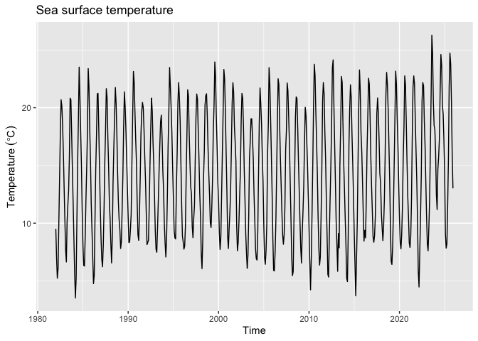
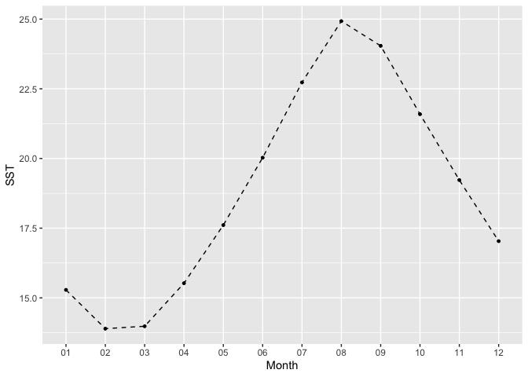
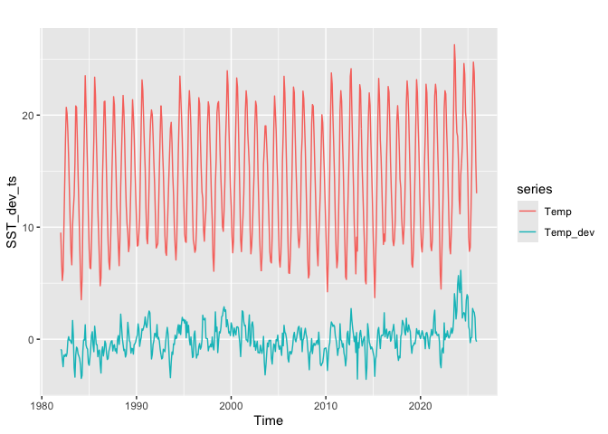
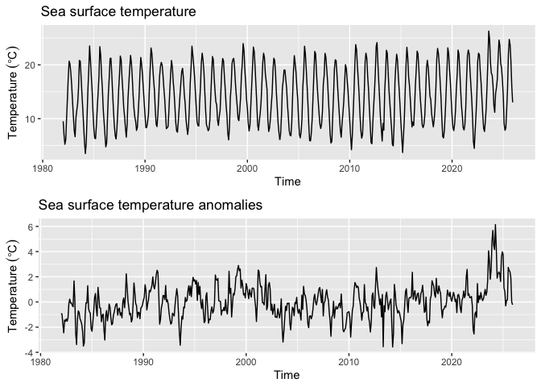
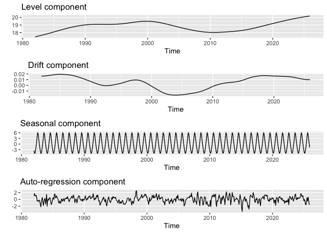
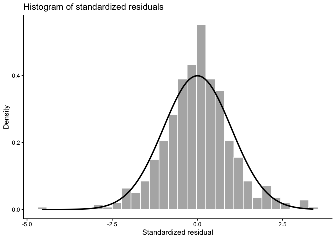
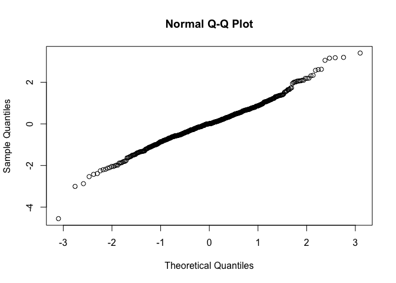
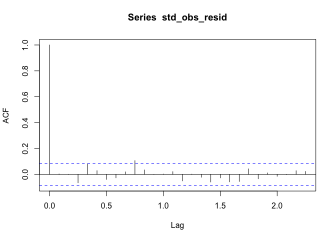
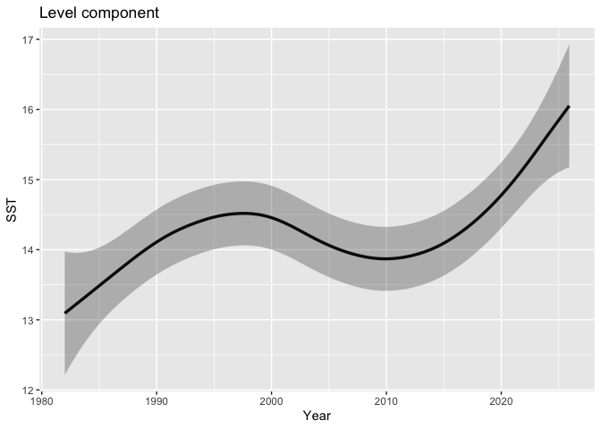
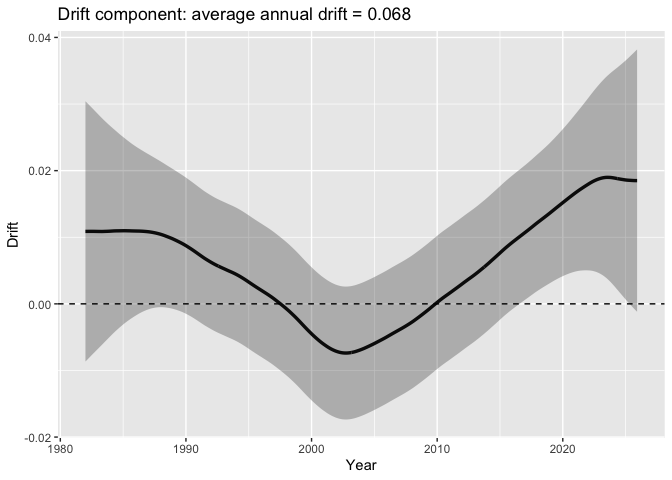

# 解析環境の設定

    ## 各種ライブラリーの読み込み
    library(KFAS)
    library(tidyverse)
    library(lubridate)
    library(forecast)

    library(gridExtra)

    # initialize
    rm(list=ls(all=TRUE))

# 海面水温時系列データの読み込み

    SST_monthly_df2ts <- function(SST_monthly_df){
      start_year_month <- min(SST_monthly_df$Time)

      # ts型に変換
      SST_ts <- SST_monthly_df %>% 
        dplyr::select(-Time) %>%             # 日付列と秋冬フラグを削除
        ts(start = c(year(start_year_month), month(start_year_month)), 
          frequency = 12) # ts型に変換(1998年1月開始。12か月1周期)
    }

    #沿岸域の海面水温情報
    #https://www.data.jma.go.jp/kaiyou/data/db/kaikyo/series/engan/engan.html
    #上記のサイトから、対象の海域番号を調べる
    #（例えば、岩手県南部沿岸の海域番号は113)

    # 水温データのソースの指定: local, url, or, original
    source <- "local" # local (default), url, or original
    # local:　local環境にある提供データ: ulr: 気象庁公開のデータ; original: 自身が用意されたオリジナルデータ

    if(source=="url"){ #ウェブサイトから海面水温データを読み込む場合
      sea_are_id <- 315　#113 岩手県南部沿岸海域の例; 122: 釧路地方沿岸; 709: 与那国島; 315:佐渡島
      url <- paste0("https://www.data.jma.go.jp/kaiyou/data/db/kaikyo/series/engan/txt/area",
                    sea_are_id,
                    ".txt")

      SST_info <- read_csv(url) %>% 
        slice(-n()) %>%
        rename(Temp="Temp.") %>% 
        mutate(Temp = as.numeric(Temp)) %>%
        mutate(date=as.Date(paste0(yyyy,"-",mm,"-",dd))) %>% 
        select(c(date,Temp,flag)) %>% 
        filter(date <= as.Date("2025-12-31"))
      
      #　SSTを月別平均に集約
      SST_monthly_avg <- SST_info %>% 
        mutate(Time = floor_date(date, unit = "month")) %>% 
        group_by(Time) %>% 
        summarise(Temp = mean(Temp, na.rm = TRUE))

      SST_ts <- SST_monthly_df2ts(SST_monthly_avg)
      SST_ts <- window(SST_ts, end = c(2025,12))
      
      
    }else if(source=="local"){ #ローカルにある海面水温データファイルを読み込む場合
      SST_info <- read_csv("SST_area133.csv") %>%  #岩手県南部沿岸海域の海面水温データ（デフォルト）
        rename(Temp="Temp.") %>% 
        mutate(date=as.Date(paste0(yyyy,"-",mm,"-",dd))) %>% 
        select(c(date,Temp,flag))
      
      #　SSTを月別平均に集約
      SST_monthly_avg <- SST_info %>% 
        mutate(Time = floor_date(date, unit = "month")) %>% 
        group_by(Time) %>% 
        summarise(Temp = mean(Temp, na.rm = TRUE))
      
      SST_ts <- SST_monthly_df2ts(SST_monthly_avg)
      SST_ts <- window(SST_ts, end = c(2025,12))
      
    }else if(source=="original"){ #ローカルに置いたオリジナルの海面水温データファイルを読み込む場合
      year_month_temp <- read_csv("SST_original.csv")
      
      SST_ts <- ts(year_month_temp$Temp,
                   start = c(year_month_temp$Year[1], year_month_temp$Month[1]),
                   frequency = 12) # ts型に変換(12か月1周期)
      names(SST_ts) <- "Temp"

    }else{
      
    }

    #欠損データセットの作成
    if(FALSE){
      half_point <- trunc(length(time(SST_ts))/2)
      NA_point <- c(half_point:(half_point+96))
      SST_ts[NA_point] <- NA 
    }

    head(SST_ts)

    ##            Jan       Feb       Mar       Apr       May       Jun
    ## 1982  9.514194  6.978214  5.238065  6.061000  9.987097 13.852333

# tsオブジェクトの内容の確認

    frequency(SST_ts)   # 周波数（12）

    ## [1] 12

    start(SST_ts)       # 開始（1982, 1）

    ## [1] 1982    1

    end(SST_ts)         # 終了（2025, 10）

    ## [1] 2025   12

    cycle(SST_ts)       # 各観測の月番号（1～12）

    ##      Jan Feb Mar Apr May Jun Jul Aug Sep Oct Nov Dec
    ## 1982   1   2   3   4   5   6   7   8   9  10  11  12
    ## 1983   1   2   3   4   5   6   7   8   9  10  11  12
    ## 1984   1   2   3   4   5   6   7   8   9  10  11  12
    ## 1985   1   2   3   4   5   6   7   8   9  10  11  12
    ## 1986   1   2   3   4   5   6   7   8   9  10  11  12
    ## 1987   1   2   3   4   5   6   7   8   9  10  11  12
    ## 1988   1   2   3   4   5   6   7   8   9  10  11  12
    ## 1989   1   2   3   4   5   6   7   8   9  10  11  12
    ## 1990   1   2   3   4   5   6   7   8   9  10  11  12
    ## 1991   1   2   3   4   5   6   7   8   9  10  11  12
    ## 1992   1   2   3   4   5   6   7   8   9  10  11  12
    ## 1993   1   2   3   4   5   6   7   8   9  10  11  12
    ## 1994   1   2   3   4   5   6   7   8   9  10  11  12
    ## 1995   1   2   3   4   5   6   7   8   9  10  11  12
    ## 1996   1   2   3   4   5   6   7   8   9  10  11  12
    ## 1997   1   2   3   4   5   6   7   8   9  10  11  12
    ## 1998   1   2   3   4   5   6   7   8   9  10  11  12
    ## 1999   1   2   3   4   5   6   7   8   9  10  11  12
    ## 2000   1   2   3   4   5   6   7   8   9  10  11  12
    ## 2001   1   2   3   4   5   6   7   8   9  10  11  12
    ## 2002   1   2   3   4   5   6   7   8   9  10  11  12
    ## 2003   1   2   3   4   5   6   7   8   9  10  11  12
    ## 2004   1   2   3   4   5   6   7   8   9  10  11  12
    ## 2005   1   2   3   4   5   6   7   8   9  10  11  12
    ## 2006   1   2   3   4   5   6   7   8   9  10  11  12
    ## 2007   1   2   3   4   5   6   7   8   9  10  11  12
    ## 2008   1   2   3   4   5   6   7   8   9  10  11  12
    ## 2009   1   2   3   4   5   6   7   8   9  10  11  12
    ## 2010   1   2   3   4   5   6   7   8   9  10  11  12
    ## 2011   1   2   3   4   5   6   7   8   9  10  11  12
    ## 2012   1   2   3   4   5   6   7   8   9  10  11  12
    ## 2013   1   2   3   4   5   6   7   8   9  10  11  12
    ## 2014   1   2   3   4   5   6   7   8   9  10  11  12
    ## 2015   1   2   3   4   5   6   7   8   9  10  11  12
    ## 2016   1   2   3   4   5   6   7   8   9  10  11  12
    ## 2017   1   2   3   4   5   6   7   8   9  10  11  12
    ## 2018   1   2   3   4   5   6   7   8   9  10  11  12
    ## 2019   1   2   3   4   5   6   7   8   9  10  11  12
    ## 2020   1   2   3   4   5   6   7   8   9  10  11  12
    ## 2021   1   2   3   4   5   6   7   8   9  10  11  12
    ## 2022   1   2   3   4   5   6   7   8   9  10  11  12
    ## 2023   1   2   3   4   5   6   7   8   9  10  11  12
    ## 2024   1   2   3   4   5   6   7   8   9  10  11  12
    ## 2025   1   2   3   4   5   6   7   8   9  10  11  12

    time(SST_ts)        # 小数年（1982.000, 1982.083...）

    ##           Jan      Feb      Mar      Apr      May      Jun      Jul      Aug
    ## 1982 1982.000 1982.083 1982.167 1982.250 1982.333 1982.417 1982.500 1982.583
    ## 1983 1983.000 1983.083 1983.167 1983.250 1983.333 1983.417 1983.500 1983.583
    ## 1984 1984.000 1984.083 1984.167 1984.250 1984.333 1984.417 1984.500 1984.583
    ## 1985 1985.000 1985.083 1985.167 1985.250 1985.333 1985.417 1985.500 1985.583
    ## 1986 1986.000 1986.083 1986.167 1986.250 1986.333 1986.417 1986.500 1986.583
    ## 1987 1987.000 1987.083 1987.167 1987.250 1987.333 1987.417 1987.500 1987.583
    ## 1988 1988.000 1988.083 1988.167 1988.250 1988.333 1988.417 1988.500 1988.583
    ## 1989 1989.000 1989.083 1989.167 1989.250 1989.333 1989.417 1989.500 1989.583
    ## 1990 1990.000 1990.083 1990.167 1990.250 1990.333 1990.417 1990.500 1990.583
    ## 1991 1991.000 1991.083 1991.167 1991.250 1991.333 1991.417 1991.500 1991.583
    ## 1992 1992.000 1992.083 1992.167 1992.250 1992.333 1992.417 1992.500 1992.583
    ## 1993 1993.000 1993.083 1993.167 1993.250 1993.333 1993.417 1993.500 1993.583
    ## 1994 1994.000 1994.083 1994.167 1994.250 1994.333 1994.417 1994.500 1994.583
    ## 1995 1995.000 1995.083 1995.167 1995.250 1995.333 1995.417 1995.500 1995.583
    ## 1996 1996.000 1996.083 1996.167 1996.250 1996.333 1996.417 1996.500 1996.583
    ## 1997 1997.000 1997.083 1997.167 1997.250 1997.333 1997.417 1997.500 1997.583
    ## 1998 1998.000 1998.083 1998.167 1998.250 1998.333 1998.417 1998.500 1998.583
    ## 1999 1999.000 1999.083 1999.167 1999.250 1999.333 1999.417 1999.500 1999.583
    ## 2000 2000.000 2000.083 2000.167 2000.250 2000.333 2000.417 2000.500 2000.583
    ## 2001 2001.000 2001.083 2001.167 2001.250 2001.333 2001.417 2001.500 2001.583
    ## 2002 2002.000 2002.083 2002.167 2002.250 2002.333 2002.417 2002.500 2002.583
    ## 2003 2003.000 2003.083 2003.167 2003.250 2003.333 2003.417 2003.500 2003.583
    ## 2004 2004.000 2004.083 2004.167 2004.250 2004.333 2004.417 2004.500 2004.583
    ## 2005 2005.000 2005.083 2005.167 2005.250 2005.333 2005.417 2005.500 2005.583
    ## 2006 2006.000 2006.083 2006.167 2006.250 2006.333 2006.417 2006.500 2006.583
    ## 2007 2007.000 2007.083 2007.167 2007.250 2007.333 2007.417 2007.500 2007.583
    ## 2008 2008.000 2008.083 2008.167 2008.250 2008.333 2008.417 2008.500 2008.583
    ## 2009 2009.000 2009.083 2009.167 2009.250 2009.333 2009.417 2009.500 2009.583
    ## 2010 2010.000 2010.083 2010.167 2010.250 2010.333 2010.417 2010.500 2010.583
    ## 2011 2011.000 2011.083 2011.167 2011.250 2011.333 2011.417 2011.500 2011.583
    ## 2012 2012.000 2012.083 2012.167 2012.250 2012.333 2012.417 2012.500 2012.583
    ## 2013 2013.000 2013.083 2013.167 2013.250 2013.333 2013.417 2013.500 2013.583
    ## 2014 2014.000 2014.083 2014.167 2014.250 2014.333 2014.417 2014.500 2014.583
    ## 2015 2015.000 2015.083 2015.167 2015.250 2015.333 2015.417 2015.500 2015.583
    ## 2016 2016.000 2016.083 2016.167 2016.250 2016.333 2016.417 2016.500 2016.583
    ## 2017 2017.000 2017.083 2017.167 2017.250 2017.333 2017.417 2017.500 2017.583
    ## 2018 2018.000 2018.083 2018.167 2018.250 2018.333 2018.417 2018.500 2018.583
    ## 2019 2019.000 2019.083 2019.167 2019.250 2019.333 2019.417 2019.500 2019.583
    ## 2020 2020.000 2020.083 2020.167 2020.250 2020.333 2020.417 2020.500 2020.583
    ## 2021 2021.000 2021.083 2021.167 2021.250 2021.333 2021.417 2021.500 2021.583
    ## 2022 2022.000 2022.083 2022.167 2022.250 2022.333 2022.417 2022.500 2022.583
    ## 2023 2023.000 2023.083 2023.167 2023.250 2023.333 2023.417 2023.500 2023.583
    ## 2024 2024.000 2024.083 2024.167 2024.250 2024.333 2024.417 2024.500 2024.583
    ## 2025 2025.000 2025.083 2025.167 2025.250 2025.333 2025.417 2025.500 2025.583
    ##           Sep      Oct      Nov      Dec
    ## 1982 1982.667 1982.750 1982.833 1982.917
    ## 1983 1983.667 1983.750 1983.833 1983.917
    ## 1984 1984.667 1984.750 1984.833 1984.917
    ## 1985 1985.667 1985.750 1985.833 1985.917
    ## 1986 1986.667 1986.750 1986.833 1986.917
    ## 1987 1987.667 1987.750 1987.833 1987.917
    ## 1988 1988.667 1988.750 1988.833 1988.917
    ## 1989 1989.667 1989.750 1989.833 1989.917
    ## 1990 1990.667 1990.750 1990.833 1990.917
    ## 1991 1991.667 1991.750 1991.833 1991.917
    ## 1992 1992.667 1992.750 1992.833 1992.917
    ## 1993 1993.667 1993.750 1993.833 1993.917
    ## 1994 1994.667 1994.750 1994.833 1994.917
    ## 1995 1995.667 1995.750 1995.833 1995.917
    ## 1996 1996.667 1996.750 1996.833 1996.917
    ## 1997 1997.667 1997.750 1997.833 1997.917
    ## 1998 1998.667 1998.750 1998.833 1998.917
    ## 1999 1999.667 1999.750 1999.833 1999.917
    ## 2000 2000.667 2000.750 2000.833 2000.917
    ## 2001 2001.667 2001.750 2001.833 2001.917
    ## 2002 2002.667 2002.750 2002.833 2002.917
    ## 2003 2003.667 2003.750 2003.833 2003.917
    ## 2004 2004.667 2004.750 2004.833 2004.917
    ## 2005 2005.667 2005.750 2005.833 2005.917
    ## 2006 2006.667 2006.750 2006.833 2006.917
    ## 2007 2007.667 2007.750 2007.833 2007.917
    ## 2008 2008.667 2008.750 2008.833 2008.917
    ## 2009 2009.667 2009.750 2009.833 2009.917
    ## 2010 2010.667 2010.750 2010.833 2010.917
    ## 2011 2011.667 2011.750 2011.833 2011.917
    ## 2012 2012.667 2012.750 2012.833 2012.917
    ## 2013 2013.667 2013.750 2013.833 2013.917
    ## 2014 2014.667 2014.750 2014.833 2014.917
    ## 2015 2015.667 2015.750 2015.833 2015.917
    ## 2016 2016.667 2016.750 2016.833 2016.917
    ## 2017 2017.667 2017.750 2017.833 2017.917
    ## 2018 2018.667 2018.750 2018.833 2018.917
    ## 2019 2019.667 2019.750 2019.833 2019.917
    ## 2020 2020.667 2020.750 2020.833 2020.917
    ## 2021 2021.667 2021.750 2021.833 2021.917
    ## 2022 2022.667 2022.750 2022.833 2022.917
    ## 2023 2023.667 2023.750 2023.833 2023.917
    ## 2024 2024.667 2024.750 2024.833 2024.917
    ## 2025 2025.667 2025.750 2025.833 2025.917

    window(SST_ts, start = c(1991, 1), end = c(2000, 12))  # 期間抽出

    ##            Jan       Feb       Mar       Apr       May       Jun       Jul
    ## 1991 11.666774  8.995714  8.515161 10.665000 13.937419 17.752667 19.617419
    ## 1992 10.913871  8.140345  8.330645  8.532333 11.589677 15.212667 18.259355
    ## 1993  9.298065  7.750357  7.479355  9.570333 11.900323 14.454667 16.727419
    ## 1994  9.944839  8.318929  7.068710  8.642333 12.298387 16.686000 19.662581
    ## 1995 12.181290  9.386786  8.724516  8.641333 12.971290 15.993333 20.376129
    ## 1996  8.884516  8.391379  7.754194  8.009000  9.736129 14.022000 17.739355
    ## 1997 12.560645  9.726786  8.744516 10.388667 11.514516 15.459667 19.175484
    ## 1998 10.617742  7.308929  6.064839  8.494333 13.859032 16.076333 20.221935
    ## 1999 12.435161 10.033571  9.626129 11.411667 13.901290 18.011000 20.245806
    ## 2000 11.876774  9.153103  7.713226  8.779667 12.418065 16.020000 19.524839
    ##            Aug       Sep       Oct       Nov       Dec
    ## 1991 20.461935 20.039667 18.164516 15.802000 13.760645
    ## 1992 20.850968 19.647333 16.972581 15.051000 12.261290
    ## 1993 18.791290 19.356667 17.502581 14.587000 12.832903
    ## 1994 23.480323 21.828667 20.017097 17.899667 14.903548
    ## 1995 22.179032 20.881667 18.843871 15.192000 11.601613
    ## 1996 21.553871 21.019000 17.755484 15.244667 13.146774
    ## 1997 21.185806 20.749333 17.956129 15.508333 12.553871
    ## 1998 21.027097 21.206333 19.308065 16.501667 14.289677
    ## 1999 23.960000 22.668000 19.200968 16.607333 13.565484
    ## 2000 23.316452 22.512000 19.680323 16.217000 12.863548

# SSTの時系列折れ線グラフ

    SST_ts_source_plot <- autoplot(SST_ts) +
      labs(y = expression(Temperature~(degree*C)), x = "Time") +
      ggtitle("Sea surface temperature")

    plot(SST_ts_source_plot)

# SST偏差系列の作成

    stopifnot(frequency(SST_ts) == 12)  # 月次であることの確認

    temp <- as.numeric(SST_ts)

    # 月番号（1〜12）を取得
    #mnum <- factor(cycle(SST_ts),levels = 1:12)
    mnum <- cycle(SST_ts)

    # 念のため 1:12 の factor に固定（欠月があっても 12要素の平均が返る）
    mfac <- factor(mnum, levels = 1:12)

    # 3) 月別の長期平均（気候値）を作る
    monthly_mean <- tapply(temp, mfac, function(v) mean(v, na.rm = TRUE))

    # 各観測に対応する月平均を展開
    clim <- monthly_mean[as.integer(mfac)]

    # 4) 海水温偏差を計算
    anom <- temp - clim

    SST_dev_ts <- cbind(Temp=SST_ts, Temp_dev=anom)

    head(SST_dev_ts)

    ##               Temp   Temp_dev
    ## Jan 1982  9.514194 -0.9041496
    ## Feb 1982  6.978214 -0.9796440
    ## Mar 1982  5.238065 -1.7847361
    ## Apr 1982  6.061000 -2.4549773
    ## May 1982  9.987097 -1.4334531
    ## Jun 1982 13.852333 -1.5439394

# 月平均SSTのプロット

    monthly_mean_fac_tidy = tibble(Month=factor(1:12,
                                            levels=(1:12)),
           SST=as.numeric(monthly_mean)
           )

    monthly_mean_tidy = tibble(Month=(1:12),
           SST=as.numeric(monthly_mean)
           )

    head(monthly_mean_tidy)

    ## # A tibble: 6 × 2
    ##   Month   SST
    ##   <int> <dbl>
    ## 1     1 10.4 
    ## 2     2  7.96
    ## 3     3  7.02
    ## 4     4  8.52
    ## 5     5 11.4 
    ## 6     6 15.4

    plot_monthly_mean_SSST <- ggplot(data=monthly_mean_fac_tidy,
                                     aes(x=Month,y=SST)
                                     ) +
      geom_point(size = 1) + 
      geom_line(data=monthly_mean_tidy,
                aes(x=Month,y=SST),linetype= "dashed") + 
      #geom_smooth(method="loess", se =FALSE)
      scale_x_discrete(
        labels = function(x) sprintf("%02d", as.integer(x))
      )
      
    plot_monthly_mean_SSST

# SST偏差系列のプロット：autoplot

    autoplot(SST_dev_ts)

# SST偏差系列のプロット: ggplot

    SST_ts_plot <- autoplot(SST_dev_ts[,"Temp"]) +
      labs(y = expression(Temperature~(degree*C)), x = "Time") +
      ggtitle("Sea surface temperature")

    SST_dev_ts_plot <- autoplot(SST_dev_ts[,"Temp_dev"]) +
      labs(y = expression(Temperature~(degree*C)), x = "Time") +
      ggtitle("Sea surface temperature anomalies")

    # 並べる
    SST_ts_source_plot <- gridExtra::grid.arrange(SST_ts_plot,
                                                  SST_dev_ts_plot,
                                                  ncol = 1)

    plot(SST_ts_source_plot)

# 線形ガウス状態空間モデルの関数の定義

    make_ssm_SST <- function(ts_data) {
      # モデルの構造を決める
      build_ssm <- SSModel(
        H = NA,
        Temp ~
          SSMtrend(degree = 2,                  # 平滑化トレンドモデル
                   Q = c(list(0), list(NA))) +
          SSMseasonal(
            sea.type = "dummy", # ダミー変数を利用した季節成分
            period = 12,        # 周期は12とする
            Q = NA
          ) +
          SSMarima(
            ar = c(0, 0),       # 2次のAR成分
            d = 0,
            Q = 0
          ),
        data = ts_data
      )
      
      # optimに渡す前にパラメータをexpしたりartransformしたり、変換する
      # ほぼbuild_ssmと同じだが、パラメータだけ変更されている
      update_func <- function(pars, model) {
        model <- SSModel(
          H = exp(pars[6]),
          Temp ~
            SSMtrend(degree = 2,
                     Q = c(list(0), list(exp(pars[1])))) +
            SSMseasonal(
              sea.type = "dummy",
              period = 12,
              Q = exp(pars[2])
            ) +
            SSMarima(
              ar = artransform(pars[3:4]),
              d = 0,
              Q = exp(pars[5])
            ),
          data = ts_data
        )
      }
      
      
      # 最適化その1。まずはNelder-Mead法を用いて暫定的なパラメータを推定
      fit_ssm_bef <- fitSSM(
        build_ssm,
        #inits = c(-17,-30, 0.5, 0, -1, -3), # パラメータの初期値(任意)
        inits = c(-13,-7, 0.9, -0.1, -0.3, -5), # パラメータの初期値(任意)
        update_func,
        method = "Nelder-Mead",
        control = list(maxit = 5000, reltol = 1e-16)
      )
      
      # 最適化その2。先ほどの結果を初期値に使ってもう一度最適化する
      fit_ssm <- fitSSM(
        build_ssm,
        inits = fit_ssm_bef$optim.out$par,
        update_func,
        method = "BFGS",
        control = list(maxit = 5000, reltol = 1e-16)
      )
      
      # フィルタリングとスムージング
      result_ssm <- KFS(
        fit_ssm$model,
        filtering = c("state", "mean"),
        smoothing = c("state", "mean", "disturbance")
      )
      
      # 結果の出力
      return(list(fit_ssm, result_ssm))
      
    }

# モデル関数の適用

    list_SST <- make_ssm_SST(SST_dev_ts)
    fit_SST    <- list_SST[[1]]
    result_SST <- list_SST[[2]]

# 推定結果の確認

    print(fit_SST$optim.out$par) #モデルの推定パラメーター

    ## [1] -13.3404402  -7.4582110   0.8734769  -0.1118677  -0.2843411  -4.6824333

    # 推定結果 -------------------------------------------------------------

    # 平滑化推定量
    head(result_SST$alphahat)

    ##             level      slope sea_dummy1 sea_dummy2 sea_dummy3 sea_dummy4
    ## Jan 1982 13.09262 0.01087899  -3.867104  -1.123972   1.689812   4.392057
    ## Feb 1982 13.10349 0.01087928  -6.234119  -3.867104  -1.123972   1.689812
    ## Mar 1982 13.11437 0.01088057  -7.279158  -6.234119  -3.867104  -1.123972
    ## Apr 1982 13.12525 0.01088282  -5.831141  -7.279158  -6.234119  -3.867104
    ## May 1982 13.13614 0.01088366  -2.705951  -5.831141  -7.279158  -6.234119
    ## Jun 1982 13.14702 0.01088442   1.136169  -2.705951  -5.831141  -7.279158
    ##          sea_dummy5 sea_dummy6 sea_dummy7 sea_dummy8 sea_dummy9 sea_dummy10
    ## Jan 1982   7.063599   8.036486   4.723322   1.136169  -2.705951   -5.831141
    ## Feb 1982   4.392057   7.063599   8.036486   4.723322   1.136169   -2.705951
    ## Mar 1982   1.689812   4.392057   7.063599   8.036486   4.723322    1.136169
    ## Apr 1982  -1.123972   1.689812   4.392057   7.063599   8.036486    4.723322
    ## May 1982  -3.867104  -1.123972   1.689812   4.392057   7.063599    8.036486
    ## Jun 1982  -6.234119  -3.867104  -1.123972   1.689812   4.392057    7.063599
    ##          sea_dummy11     arima1      arima2
    ## Jan 1982   -7.279158  0.2869777 -0.02368293
    ## Feb 1982   -5.831141  0.1048145 -0.03197027
    ## Mar 1982   -2.705951 -0.5969186 -0.01167669
    ## Apr 1982    1.136169 -1.2195174  0.06649873
    ## May 1982    4.723322 -0.4507217  0.13585833
    ## Jun 1982    8.036486 -0.4258073  0.05021190

    level <- result_SST$alphahat[,"level"]
    drift <- result_SST$alphahat[,"slope"]

    level_ts <- ts(level, start = start(SST_ts), frequency = 12)
    drift_ts <- ts(drift, start = start(SST_ts), frequency = 12)

    # 年あたりの平均的な昇温率
    mean_drift_year <- mean(drift_ts) * 12
    print(mean_drift_year)

    ## [1] 0.06768336

    # 係数の95%信頼区間
    res <- confint(result_SST, level = 0.95)

    # 成分別にプロット
    model_level_plot <- autoplot(result_SST$alphahat[,"level"]) +
      labs(y = "", x = "Time") +
      ggtitle("Level component")

    model_slope_plot <- autoplot(result_SST$alphahat[,"slope"]) +
      labs(y = "", x = "Time") +
      ggtitle("Drift component")

    model_season_plot <- autoplot(result_SST$alphahat[,"sea_dummy1"]) +
      labs(y = "", x = "Time") +
      ggtitle("Seasonal component")

    model_arima1_plot <- autoplot(result_SST$alphahat[,"arima1"]) +
      labs(y = "", x = "Time") +
      ggtitle("Auto-regression component")

    model_out_plot <- grid.arrange(model_level_plot,
                                  model_slope_plot,
                                  model_season_plot,
                                  model_arima1_plot,
                                  ncol = 1)

    plot(model_out_plot )

# モデルの残差の確認

    # 標準化残差
    std_obs_resid <- rstandard(result_SST, type = "recursive")

    #正規性の確認
    resid_df <- data.frame(resid = std_obs_resid)

    resid_dist_plot <- ggplot(resid_df, aes(x = resid)) +
      geom_histogram(aes(y = after_stat(density)),
                     bins = 30,
                     fill = "grey70",
                     color = "white") +
      stat_function(fun = dnorm, linewidth = 1) +
      labs(
        title = "Histogram of standardized residuals",
        x = "Standardized residual",
        y = "Density"
      ) +
      theme_classic()
    plot(resid_dist_plot)

    qqnorm(std_obs_resid)

    # 自己相関コレログラム
    acf(std_obs_resid, na.action = na.pass)

    # Ljung–Box検定
    # P > 0.05で残差に有意な自己相関なしと判断
    Box.test(std_obs_resid,
             lag = 24,
             type = "Ljung-Box")

    ## 
    ##  Box-Ljung test
    ## 
    ## data:  std_obs_resid
    ## X-squared = 23.325, df = 24, p-value = 0.5007

# 水準変動の信頼区間の図示

    level_tidy <- cbind(
      data.frame(time=time(SST_ts),
                 SST=as.numeric(SST_ts),
                 level=level),
      as.data.frame(res$level)
      ) %>%
      as_tibble()

    level_plot <- ggplot(data=level_tidy,
                             aes(x=time,y=SST)) +
      labs(title="Level component",x="Year", y="SST") +
      #geom_point(alpha = 0.5) +
      geom_line(aes(y=level), size = 1.2) +
      geom_ribbon(aes(ymin = lwr, ymax = upr), alpha = 0.3)

    ggsave("level_plot.png",
           width=6, height=4,
           plot = level_plot)

    level_plot

# ドリフト成分の図示

    drift_tidy <- cbind(
      data.frame(time=time(SST_ts),
                 Temp=as.numeric(SST_ts),
                 drift=drift),
      as.data.frame(res$slope)
      ) %>%
      as_tibble()

    annual_drift_lab <- paste0("average annual drift = ",round(mean_drift_year,3))
    drift_plot <- ggplot(data=drift_tidy,
                             aes(x=time,y=drift)) +
      labs(title=paste0("Drift component: ",annual_drift_lab),
           x="Year", y="Drift") +
      geom_line(aes(y=drift), size = 1.2) +
      geom_ribbon(aes(ymin = lwr, ymax = upr), alpha = 0.3) +
      geom_hline(yintercept=0, linetype="dashed") 

    ggsave("drift_plot.png",
           width=6, height=4,
           plot = drift_plot)

    drift_plot

# 予測 ———————————————————————-

    # 簡単な方法

    forecast_pred <- predict(result_SST$model,
                             interval="prediction",
                             level = 0.95,
                             n.ahead = 6)

    print(forecast_pred)

    ##                fit       lwr      upr
    ## Jan 2026 10.910108  9.119202 12.70101
    ## Feb 2026  8.843959  6.573132 11.11479
    ## Mar 2026  8.344034  5.881440 10.80663
    ## Apr 2026 10.166778  7.621817 12.71174
    ## May 2026 13.047616 10.463373 15.63186
    ## Jun 2026 17.077530 14.471921 19.68314

# Rスクリプトの出力

    knitr::purl("SST_ts_analyses.Rmd", 
                output ="SST_ts_analyses.r",
                documentation = 0)

    ##   |                                                           |                                                   |   0%  |                                                           |..                                                 |   3%                     |                                                           |...                                                |   6% [unnamed-chunk-33]  |                                                           |.....                                              |   9%                     |                                                           |......                                             |  12% [unnamed-chunk-34]  |                                                           |........                                           |  16%                     |                                                           |..........                                         |  19% [unnamed-chunk-35]  |                                                           |...........                                        |  22%                     |                                                           |.............                                      |  25% [unnamed-chunk-36]  |                                                           |..............                                     |  28%                     |                                                           |................                                   |  31% [unnamed-chunk-37]  |                                                           |..................                                 |  34%                     |                                                           |...................                                |  38% [unnamed-chunk-38]  |                                                           |.....................                              |  41%                     |                                                           |......................                             |  44% [unnamed-chunk-39]  |                                                           |........................                           |  47%                     |                                                           |..........................                         |  50% [unnamed-chunk-40]  |                                                           |...........................                        |  53%                     |                                                           |.............................                      |  56% [unnamed-chunk-41]  |                                                           |..............................                     |  59%                     |                                                           |................................                   |  62% [unnamed-chunk-42]  |                                                           |.................................                  |  66%                     |                                                           |...................................                |  69% [unnamed-chunk-43]  |                                                           |.....................................              |  72%                     |                                                           |......................................             |  75% [unnamed-chunk-44]  |                                                           |........................................           |  78%                     |                                                           |.........................................          |  81% [unnamed-chunk-45]  |                                                           |...........................................        |  84%                     |                                                           |.............................................      |  88% [unnamed-chunk-46]  |                                                           |..............................................     |  91%                     |                                                           |................................................   |  94% [unnamed-chunk-47]  |                                                           |.................................................  |  97%                     |                                                           |...................................................| 100% [unnamed-chunk-48]

    ## [1] "SST_ts_analyses.r"
