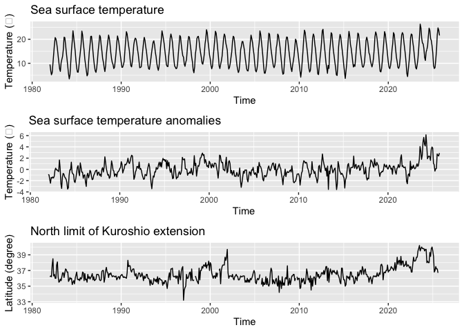

# 解析環境の設定

    ## 各種ライブラリーの読み込み
    library(KFAS)
    library(tidyverse)
    library(lubridate)
    library(forecast)

    library(gridExtra)

    ##作業場所の設定
    cur_dir <- getwd()
    #print(cur_dir)
    setwd(cur_dir)

    # initialize
    rm(list=ls(all=TRUE))

# 海面水温時系列データの読み込み

    #沿岸域の海面水温情報
    #https://www.data.jma.go.jp/kaiyou/data/db/kaikyo/series/engan/engan.html
    #上記のサイトから、対象の海域番号を調べる
    #（例えば、岩手県南部沿岸の海域番号は113)

    #ウェブサイトから海面水温データを読み込む
    #source <- "original" # local (default), url or original
    source <- "local" # local (default), url or original

    if(source=="url"){
      sea_are_id <- 113　#岩手県南部沿岸海域の例
      url <- paste0("https://www.data.jma.go.jp/kaiyou/data/db/kaikyo/series/engan/txt/area",
                    sea_are_id,
                    "-past.txt")

      SST_info <- read_csv(url) %>% 
        rename(Temp="Temp.") %>% 
        mutate(date=as.Date(paste0(yyyy,"-",mm,"-",dd))) %>% 
        select(c(date,Temp,flag))
      
      #　SSTを月別平均に集約
      SST_monthly_avg <- SST_info %>% 
        mutate(Time = floor_date(date, "month")) %>% 
        group_by(Time) %>% 
        summarise(Temp = mean(Temp, na.rm = TRUE)) %>% 
        mutate(month=month(Time))

      
    }else if(source=="local"){
      #ローカルにある海面水温データファイルを読み込む
      SST_info <- read_csv("SST_area133.csv") %>%  #岩手県南部沿岸海域の海面水温データ（デフォルト）
        rename(Temp="Temp.") %>% 
        mutate(date=as.Date(paste0(yyyy,"-",mm,"-",dd))) %>% 
        select(c(date,Temp,flag))
      
      #　SSTを月別平均に集約
      SST_monthly_avg <- SST_info %>% 
        mutate(Time = floor_date(date, "month")) %>% 
        group_by(Time) %>% 
        summarise(Temp = mean(Temp, na.rm = TRUE)) %>% 
        mutate(month=month(Time))
      
    }else if(source=="original"){
      #ローカルにある自前の海面水温データファイルを読み込む
      SST_monthly_avg <- read_csv("SST_original.csv") %>%
        mutate(month=month(Time))
    }else{
      
    }

    head(SST_monthly_avg)

    ## # A tibble: 6 × 3
    ##   Time        Temp month
    ##   <date>     <dbl> <dbl>
    ## 1 1982-01-01  9.51     1
    ## 2 1982-02-01  6.98     2
    ## 3 1982-03-01  5.24     3
    ## 4 1982-04-01  6.06     4
    ## 5 1982-05-01  9.99     5
    ## 6 1982-06-01 13.9      6

# SST偏差系列の追加

    # 月毎のSSTを複数年に渡って平均
    monthly_avg_SST <- SST_monthly_avg %>%
      group_by(month) %>%
      summarise(Temp_avg=mean(Temp))

    # 海水温偏差系列の作成
    SST_monthly_avg <- SST_monthly_avg %>%
      mutate(Dev_Temp = case_when(
        month == 1 ~ Temp - as.numeric(monthly_avg_SST[monthly_avg_SST$month==1,2]),
        month == 2 ~ Temp - as.numeric(monthly_avg_SST[monthly_avg_SST$month==2,2]),
        month == 3 ~ Temp - as.numeric(monthly_avg_SST[monthly_avg_SST$month==3,2]),
        month == 4 ~ Temp - as.numeric(monthly_avg_SST[monthly_avg_SST$month==4,2]),
        month == 5 ~ Temp - as.numeric(monthly_avg_SST[monthly_avg_SST$month==5,2]),
        month == 6 ~ Temp - as.numeric(monthly_avg_SST[monthly_avg_SST$month==6,2]),
        month == 7 ~ Temp - as.numeric(monthly_avg_SST[monthly_avg_SST$month==7,2]),
        month == 8 ~ Temp - as.numeric(monthly_avg_SST[monthly_avg_SST$month==8,2]),
        month == 9 ~ Temp - as.numeric(monthly_avg_SST[monthly_avg_SST$month==9,2]),
        month == 10 ~ Temp - as.numeric(monthly_avg_SST[monthly_avg_SST$month==10,2]),
        month == 11 ~ Temp - as.numeric(monthly_avg_SST[monthly_avg_SST$month==11,2]),
        month == 12 ~ Temp - as.numeric(monthly_avg_SST[monthly_avg_SST$month==12,2])
        
      )
    )

    head(SST_monthly_avg)

    ## # A tibble: 6 × 4
    ##   Time        Temp month Dev_Temp
    ##   <date>     <dbl> <dbl>    <dbl>
    ## 1 1982-01-01  9.51     1   -0.904
    ## 2 1982-02-01  6.98     2   -0.980
    ## 3 1982-03-01  5.24     3   -1.78 
    ## 4 1982-04-01  6.06     4   -2.45 
    ## 5 1982-05-01  9.99     5   -1.43 
    ## 6 1982-06-01 13.9      6   -1.54

# SSTデータセットをts型へ変換

    start_year_month <- min(SST_monthly_avg$Time)

    # ts型に変換
    SST_ts <- SST_monthly_avg %>% 
      dplyr::select(-Time) %>%             # 日付列と秋冬フラグを削除
      ts(start = c(year(start_year_month), month(start_year_month)), 
         frequency = 12) # ts型に変換(1998年1月開始。12か月1周期)

    head(SST_ts)

    ##               Temp month   Dev_Temp
    ## Jan 1982  9.514194     1 -0.9041496
    ## Feb 1982  6.978214     2 -0.9796440
    ## Mar 1982  5.238065     3 -1.7847361
    ## Apr 1982  6.061000     4 -2.4549773
    ## May 1982  9.987097     5 -1.4334531
    ## Jun 1982 13.852333     6 -1.5439394

# SSTの時系列折れ線グラフ

    # 時系列折れ線グラフ
    SST_ts_plot <- autoplot(SST_ts[,"Temp"]) +
      labs(y = "Temperature (℃)", x = "Time") +
      ggtitle("Sea surface temperature")

    SST_dev_ts_plot <- autoplot(SST_ts[,"Dev_Temp"]) +
      labs(y = "Temperature (℃)", x = "Time") +
      ggtitle("Sea surface temperature anomalies")

    # 並べる
    gridExtra::grid.arrange(SST_ts_plot, 
                            SST_dev_ts_plot,
                            ncol = 1)

# 黒潮続流北限緯度データの読み込み

### <https://ocean.fra.go.jp/temp/O-K.html>

### 本数値データ(ダウングレード加工済み)は令和７年資源評価研修の教材として、水産資源研究所海洋環境部の使用許可を受けたものです。

### 2次利用配布不可でお願いします!！！

    #黒潮続流北限緯度データの読み込み
    ## gknmay9.txtファイルは本github上にはありません。別途の案内先から入手ください。
    Kuroshio_lat_limit <- read_table("gknmay9.txt",
                                     col_names=FALSE) %>%
      rename(Year="X1",
             Month="X2",
             Kuroshio="X4") %>%
      mutate(Time=as.Date(paste0(Year,"-",Month,"-01"))) %>%
      dplyr::select(Time, Kuroshio)

    if(!exists("SST_info")){
      stop("あなたのデータセットではこれ以降の解析には対応していません")
    }

    # SSTデータの開始日にあわせて、黒潮続流データをトリミング
    Kuroshio_lat_limit <- Kuroshio_lat_limit %>%
      filter(Time >= start_year_month) %>%
      filter(Time < as.Date("2025-09-01")) 

    #　黒潮続流データの欠損値999をNAに置換
    Kuroshio_lat_limit <- Kuroshio_lat_limit %>%
      mutate(Kuroshio=na_if(Kuroshio, 999))

    # SSTと黒潮続流データを結合
    SST_Kuroshio_monthly_avg <- left_join(SST_monthly_avg,
                                          Kuroshio_lat_limit,
                                          by = join_by(Time))
    SST_Kuroshio_first_time <- min(SST_Kuroshio_monthly_avg$Time)
    head(SST_Kuroshio_monthly_avg)

    ## # A tibble: 6 × 5
    ##   Time        Temp month Dev_Temp Kuroshio
    ##   <date>     <dbl> <dbl>    <dbl>    <dbl>
    ## 1 1982-01-01  9.51     1   -0.904     36.2
    ## 2 1982-02-01  6.98     2   -0.980     36.3
    ## 3 1982-03-01  5.24     3   -1.78      36.2
    ## 4 1982-04-01  6.06     4   -2.45      37.7
    ## 5 1982-05-01  9.99     5   -1.43      38.5
    ## 6 1982-06-01 13.9      6   -1.54      36.3

# SSTと黒潮続流のデータセットをts型に変換

    SST_Kuroshio_ts <- SST_Kuroshio_monthly_avg %>% 
      dplyr::select(-Time) %>%             # 日付列と秋冬フラグを削除
      ts(start = c(year(SST_Kuroshio_first_time), month(SST_Kuroshio_first_time)), 
                        frequency = 12) # ts型に変換(1998年1月開始。12か月1周期)

    head(SST_Kuroshio_ts)

    ##               Temp month   Dev_Temp Kuroshio
    ## Jan 1982  9.514194     1 -0.9041496     36.2
    ## Feb 1982  6.978214     2 -0.9796440     36.3
    ## Mar 1982  5.238065     3 -1.7847361     36.2
    ## Apr 1982  6.061000     4 -2.4549773     37.7
    ## May 1982  9.987097     5 -1.4334531     38.5
    ## Jun 1982 13.852333     6 -1.5439394     36.3

# SSTの時系列折れ線グラフ

    # 時系列折れ線グラフ
    SST_ts_plot2 <- autoplot(SST_Kuroshio_ts[,"Temp"]) +
      labs(y = "Temperature (℃)", x = "Time") +
      ggtitle("Sea surface temperature")

    SST_dev_ts_plot2 <- autoplot(SST_Kuroshio_ts[,"Dev_Temp"]) +
      labs(y = "Temperature (℃)", x = "Time") +
      ggtitle("Sea surface temperature anomalies")

    Kuroshio_ts_plot <- autoplot(SST_Kuroshio_ts[,"Kuroshio"]) +
      labs(y = "Latitude (degree)", x = "Time") +
      ggtitle("North limit of Kuroshio extension")

    # 並べてプロット
    gridExtra::grid.arrange(SST_ts_plot2, 
                            SST_dev_ts_plot2,
                            Kuroshio_ts_plot,
                            ncol = 1)

# 線形ガウス状態空間モデルの関数の定義

    make_ssm_kuroshio <- function(ts_data) {
      # モデルの構造を決める
      build_ssm <- SSModel(
        H = NA,
        Temp ~
          SSMtrend(degree = 2,                  # 平滑化トレンドモデル
                   Q = c(list(0), list(NA))) +
          SSMseasonal(
            sea.type = "dummy", # ダミー変数を利用した季節成分
            period = 12,        # 周期は12とする
            Q = NA
          ) +
          SSMarima(
            ar = c(0, 0),       # 2次のAR成分
            d = 0,
            Q = 0
          ) + Kuroshio, # 外生変数
        data = ts_data
      )
      
      # optimに渡す前にパラメータをexpしたりartransformしたり、変換する
      # ほぼbuild_ssmと同じだが、パラメータだけ変更されている
      update_func <- function(pars, model) {
        model <- SSModel(
          H = exp(pars[6]),
          Temp ~
            SSMtrend(degree = 2,
                     Q = c(list(0), list(exp(pars[1])))) +
            SSMseasonal(
              sea.type = "dummy",
              period = 12,
              Q = exp(pars[2])
            ) +
            SSMarima(
              ar = artransform(pars[3:4]),
              d = 0,
              Q = exp(pars[5])
            ) + Kuroshio,
          data = ts_data
        )
      }
      
      
      # 最適化その1。まずはNelder-Mead法を用いて暫定的なパラメータを推定
      fit_ssm_bef <- fitSSM(
        build_ssm,
        inits = c(-17,-30, 0.5, 0, -1, -3), # パラメータの初期値(任意)
        update_func,
        method = "Nelder-Mead",
        control = list(maxit = 5000, reltol = 1e-16)
      )
      
      # 最適化その2。先ほどの結果を初期値に使ってもう一度最適化する
      fit_ssm <- fitSSM(
        build_ssm,
        inits = fit_ssm_bef$optim.out$par,
        update_func,
        method = "BFGS",
        control = list(maxit = 5000, reltol = 1e-16)
      )
      
      # フィルタリングとスムージング
      result_ssm <- KFS(
        fit_ssm$model,
        filtering = c("state", "mean"),
        smoothing = c("state", "mean", "disturbance")
      )
      
      # 結果の出力
      return(list(fit_ssm, result_ssm))
      
    }

# モデル関数の適用

    list_kuroshio <- make_ssm_kuroshio(SST_Kuroshio_ts)
    fit_kuroshio    <- list_kuroshio[[1]]
    result_kuroshio <- list_kuroshio[[2]]

    # 推定結果 -------------------------------------------------------------

    # 平滑化推定量
    head(result_kuroshio$alphahat)

    ##           Kuroshio    level      slope sea_dummy1 sea_dummy2 sea_dummy3
    ## Jan 1982 0.1048031 9.266933 0.01121578  -3.851349  -1.130797   1.683231
    ## Feb 1982 0.1048031 9.278149 0.01121613  -6.217996  -3.851349  -1.130797
    ## Mar 1982 0.1048031 9.289365 0.01121752  -7.244678  -6.217996  -3.851349
    ## Apr 1982 0.1048031 9.300582 0.01122013  -5.814564  -7.244678  -6.217996
    ## May 1982 0.1048031 9.311803 0.01122126  -2.731540  -5.814564  -7.244678
    ## Jun 1982 0.1048031 9.323024 0.01122187   1.124226  -2.731540  -5.814564
    ##          sea_dummy4 sea_dummy5 sea_dummy6 sea_dummy7 sea_dummy8 sea_dummy9
    ## Jan 1982   4.362677   7.057405   8.037522   4.725862   1.124226  -2.731540
    ## Feb 1982   1.683231   4.362677   7.057405   8.037522   4.725862   1.124226
    ## Mar 1982  -1.130797   1.683231   4.362677   7.057405   8.037522   4.725862
    ## Apr 1982  -3.851349  -1.130797   1.683231   4.362677   7.057405   8.037522
    ## May 1982  -6.217996  -3.851349  -1.130797   1.683231   4.362677   7.057405
    ## Jun 1982  -7.244678  -6.217996  -3.851349  -1.130797   1.683231   4.362677
    ##          sea_dummy10 sea_dummy11     arima1      arima2
    ## Jan 1982   -5.814564   -7.244678  0.3047355 -0.02314104
    ## Feb 1982   -2.731540   -5.814564  0.1137067 -0.03217631
    ## Mar 1982    1.124226   -2.731540 -0.6004965 -0.01200602
    ## Apr 1982    4.725862    1.124226 -1.3760967  0.06340502
    ## May 1982    8.037522    4.725862 -0.6280872  0.14529883
    ## Jun 1982    7.057405    8.037522 -0.3992713  0.06631826

    # 係数の95%信頼区間
    res <- confint(result_kuroshio, level = 0.95)
    res[c("Kuroshio")] %>% lapply(head, n = 1)

    ## $Kuroshio
    ##                  lwr       upr
    ## Jan 1982 -0.01849302 0.2280993

    # 状態の可視化
    #autoplot(
    #  result_kuroshio$alphahat[, c("level", "slope", "sea_dummy1", "arima1")],
    #  facets = TRUE
    #)

    model_level_plot <- autoplot(result_kuroshio$alphahat[,"level"]) +
      labs(y = "", x = "Time") +
      ggtitle("Level component")

    model_slope_plot <- autoplot(result_kuroshio$alphahat[,"slope"]) +
      labs(y = "", x = "Time") +
      ggtitle("Drift component")

    model_season_plot <- autoplot(result_kuroshio$alphahat[,"sea_dummy1"]) +
      labs(y = "", x = "Time") +
      ggtitle("Seasonal component")

    model_arima1_plot <- autoplot(result_kuroshio$alphahat[,"arima1"]) +
      labs(y = "", x = "Time") +
      ggtitle("Auto-regression component")

    model_out_plot <- grid.arrange(model_level_plot,
                                  model_slope_plot,
                                  model_season_plot,
                                  model_arima1_plot,
                                  ncol = 1)

